# Argo Workflows Internals

To operate, debug, and optimize machine learning pipelines on Kubernetes, understanding the mechanical implementation of Argo Workflows is essential. Argo is not a distinct runtime daemon running outside Kubernetes; it is a Kubernetes operator that translates high-level directed acyclic graph (DAG) definitions into standard Kubernetes resources.

This document traces the internal mechanics of the Argo Workflows controller, details the pod execution lifecycle and the `argoexec` roles that automate artifact handoff, explains failure recovery and caching semantics, and examines the structural boundary between workflow orchestration and multi-node distributed model training.

---

## 1. The Controller Reconcile Loop

The core execution engine of Argo Workflows is the `workflow-controller`, deployed as a standard Kubernetes Deployment. Rather than running a separate centralized scheduler outside Kubernetes, Argo operates entirely within the Kubernetes control plane using the declarative reconcile loop pattern.

In standard Kubernetes, controllers reconcile primitive single-step resources like Pods and ReplicaSets. In machine learning pipelines, the Argo controller reconciles a multi-step Directed Acyclic Graph (DAG):

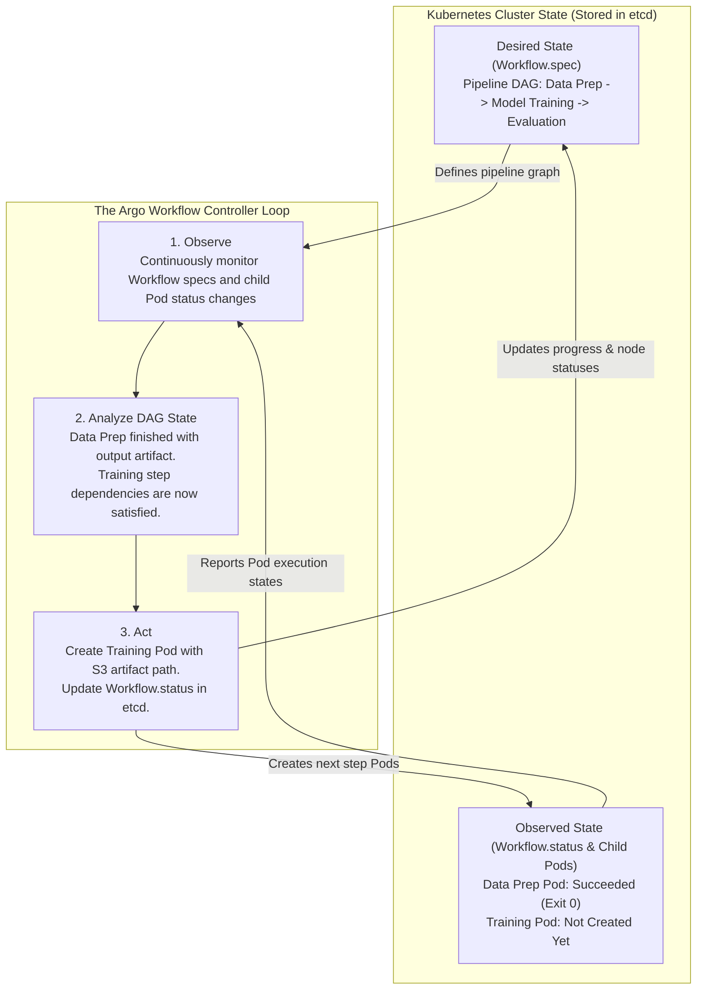

### Declarative DAG Convergence

The controller continuously drives cluster reality toward the desired DAG state:

1. **Observe (Monitor Cluster State)**: The controller continuously monitors two resource types via the Kubernetes API: `Workflow` custom resources and all `Pod` resources owned by those workflows. Whenever a step Pod changes state (for example, transitioning from `Running` to `Succeeded` or `Failed`), the controller is notified.
2. **Analyze (Evaluate DAG State Machine)**: The controller evaluates the current execution graph against the pipeline definition (`spec.templates`):
   - Which steps have completed successfully?
   - Did any step fail, and does its retry policy permit another attempt?
   - Which downstream steps now have all their prerequisite dependencies satisfied?
3. **Act (Execute Cluster Mutations)**: For steps whose prerequisites are newly satisfied, the controller generates new Pod manifests, injects concrete upstream artifact locations and parameters into their specifications, and submits them to the Kubernetes API server. It simultaneously updates `Workflow.status` in `etcd` to reflect current node execution states.

Just like standard Kubernetes controllers, the `workflow-controller` is completely level-triggered and stateless: it maintains no critical execution state in local memory and derives pipeline progress entirely from `etcd`. If the controller crashes, is evicted, or restarts mid-pipeline, a replacement pod immediately resumes reconciliation from the latest cluster state without losing progress or duplicating completed steps.

---

## 2. Pod Execution Lifecycle and Artifact Passing

In a distributed Kubernetes cluster, Pods are ephemeral units scheduled onto arbitrary worker nodes. A data preparation Pod may run on Node A, while the downstream model training Pod runs on Node B. Because worker nodes do not share a local POSIX filesystem, data cannot be passed between steps via local disk directories.

Argo Workflows solves this without requiring users to embed object storage code into their training scripts. Instead, Argo coordinates data movement around the user container using a single helper binary: the **`argoexec` executor**.

### Two Distinct Workloads in Every Step Pod

Architecturally, every step Pod contains only two workloads:
1. **The User Application (`main`)**: The unmodified Docker container running data science code (Python, PyTorch, XGBoost). It reads from `/tmp/inputs` and writes to `/tmp/outputs` using local POSIX file calls.
2. **The Argo Executor (`argoexec`)**: A single lightweight Go binary provided by Argo that handles all interaction with external object storage (MinIO/S3) and the Kubernetes API server.

### Why Kubernetes Declares Separate Lifecycle Phases

Even though `argoexec` is a single binary doing both download and upload, Kubernetes enforces a strict container lifecycle rule: `initContainers` must run to completion and exit `0` before any application container in `spec.containers` is started. A single container cannot run *before* the application, sleep, and wake up *after* it exits.

To bridge this, Argo divides the executor's duties across two lifecycle phases, coordinated through a Pod-scoped `emptyDir` scratch volume:

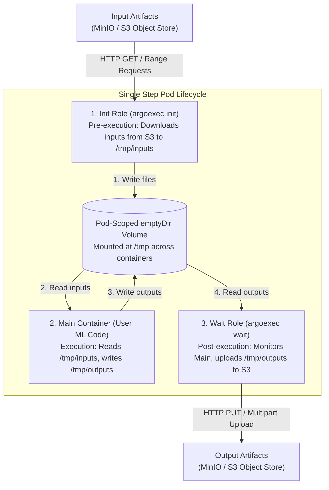

### Phase 1: The Init Role (`argoexec init`)

Before the user application code starts, the Kubernetes kubelet executes the Pod's init container:

1. The init container runs the `argoexec` binary with the `init` subcommand.
2. It mounts the Pod-scoped `emptyDir` volume at a path such as `/tmp`.
3. It inspects the Pod's JSON template metadata, stored by the controller in the Pod annotation `workflows.argoproj.io/template`.
4. It identifies all declared `inputs.artifacts`.
5. Using an embedded S3-compatible client, it issues authenticated HTTP requests to the configured artifact repository (MinIO or cloud object storage), downloads the required files, and writes them into `/tmp/inputs`.
6. Once all input artifacts are downloaded and placed on disk, the init container exits with status code `0`.

### Phase 2: The Main Container (User Application Code)

The main container contains the user's unmodified Docker image (for example, Python with PyTorch or XGBoost):

1. It starts only after the init container exits with status `0`.
2. It mounts the shared `emptyDir` volume at the configured paths.
3. The training script reads input data directly from the local filesystem (`/tmp/inputs/features.parquet`).
4. The training script processes data, fits model parameters, and writes output files to the local filesystem (`/tmp/outputs/model.json`).
5. The code contains zero imports for `boto3`, zero S3 endpoint URLs, and zero storage access keys.
6. When execution finishes, the application process terminates with an exit status code (e.g., `0` for success).

### Phase 3: The Wait Role (`argoexec wait`)

The wait role runs the `argoexec` binary with the `wait` subcommand to monitor completion and handle outputs:

1. It tracks the main container process.
2. When the main container process terminates, `argoexec` captures the final process exit code.
3. If the main container succeeded (exit code `0`), `argoexec` scans `/tmp/outputs` for declared output artifacts and output parameter files.
4. It reads the files from the shared `emptyDir` volume and uploads them to the object storage bucket under a deterministic S3 key prefix (e.g., `artifacts/workflow-name/step-name/output-name`).
5. It compiles the execution results (artifact storage keys, parameter values, container exit code) into a JSON payload.
6. Using its Pod-scoped ServiceAccount credentials, `argoexec` records this payload into a standard annotation on its own Pod object:
   ```yaml
   metadata:
     annotations:
       workflows.argoproj.io/outputs: '{"artifacts":[{"name":"model","s3":{"key":"ml-bucket/models/xgb-1.json"}}]}'
   ```
7. After the API server confirms the annotation update, the wait process exits with code `0`.

!!! note "The Modern Emissary Executor: True 2-Container Model"
    In modern Argo Workflows clusters (v3.1+), the **Emissary executor** streamlines this runtime pattern into a true two-container model. Instead of running a parallel `wait` sidecar container alongside `main`, an init step copies the `argoexec` binary into an in-memory volume, and the `main` container command is wrapped as `/argo/argoexec emissary -- <user-command>`. In this configuration, `argoexec` supervises the user process as a parent process directly within the `main` container, capturing outputs and patching annotations when the child process exits, completely eliminating the separate runtime sidecar container.

---

## 3. Downstream Resolution and State Propagation

Once a Pod finishes, the workflow controller updates the global graph state in `etcd` and prepares downstream steps for scheduling.

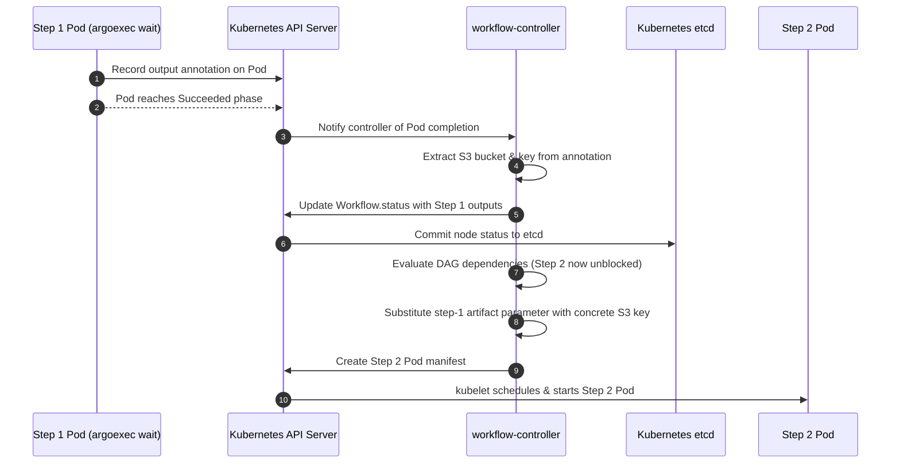

### The Downstream Resolution Sequence

1. **Status Notification**: When the step Pod finishes and records its output annotation, the Kubernetes API server notifies the workflow controller of the Pod's completion, triggering a new reconciliation cycle for that Workflow.
2. **Status Update**: The controller inspects the Pod, reads the `workflows.argoproj.io/outputs` annotation, extracts the concrete artifact location (`bucket: ml-bucket, key: models/xgb-1.json`), and updates the parent `Workflow` custom resource. The location is stored in `Workflow.status.nodes["step-1"].outputs.artifacts`.
3. **Topological Evaluation**: The controller traverses the DAG. It identifies that `step-2` depends on `step-1` and that `step-1` has reached `Succeeded`. `step-2` is now marked ready.
4. **Concrete Template Substitution**: Before generating the Pod manifest for `step-2`, the controller scans `step-2`'s template arguments:
   ```yaml
   arguments:
     artifacts:
       - name: input-model
         from: "{{tasks.step-1.outputs.artifacts.model}}"
   ```
   The controller performs literal string substitution against its local cache of `Workflow.status`. It replaces the template expression with the concrete S3 key:
   ```yaml
   # Concrete resolved artifact spec injected into Step 2 Pod definition
   inputs:
     artifacts:
       - name: input-model
         path: /tmp/inputs/model.json
         s3:
           endpoint: minio.storage.svc:9000
           bucket: ml-bucket
           key: models/xgb-1.json
   ```
5. **Pod Creation**: The controller submits the fully resolved Pod manifest to `POST /api/v1/namespaces/{ns}/pods`. When `step-2`'s init container launches, it receives an explicit, unambiguous S3 location to download, with zero runtime lookup or search queries required.

---

## 4. Artifact Archiving Mechanics and Optimizations

By default, Argo Workflows tar-gzips all output artifacts before uploading them to object storage:

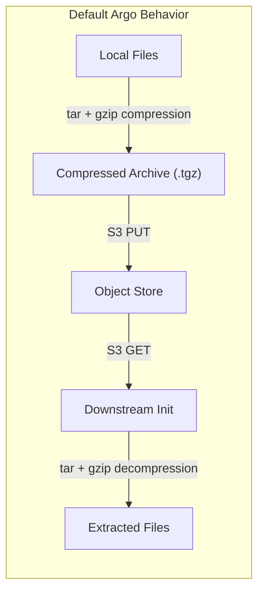

### The Parquet and Columnar Inefficiency

For raw text, CSV files, or uncompressed log dumps, compressing files prior to network transfer reduces bandwidth consumption. However, in modern machine learning infrastructure, intermediate datasets are stored as columnar binary formats such as **Apache Parquet**.

Parquet files already incorporate internal, page-level compression algorithms (such as Snappy or Zstandard) applied to typed, encoded binary data. 

Subjecting Parquet partitions to an external `tar -czf` pass introduces severe inefficiencies:

- **CPU Saturation**: Compressing multi-gigabyte Parquet partitions pins the CPU core running the `argoexec` wait container, adding minutes of latency to the step completion phase.
- **Negligible Space Savings**: Because the data pages are already compressed, the secondary gzip compression ratio is negligible (typically less than 1% size reduction).
- **Download Bottleneck**: When the downstream step starts, its init container must decompress and untar the archive before the main container can begin execution, doubling the CPU penalty across the pipeline.

### The Direct Storage Fix: `archive: {none: {}}`

To eliminate unnecessary compression overhead, ML pipeline steps producing columnar data must explicitly disable archiving:

```yaml
outputs:
  artifacts:
    - name: cleaned-feature-table
      path: /tmp/outputs/features/
      archive:
        none: {}
```

When `archive: {none: {}}` is specified:

1. `argoexec` skips the tar-gzip pipeline entirely.
2. If the path is a directory, `argoexec` uploads each file as an individual object under the S3 prefix, preserving directory hierarchy.
3. The downstream init container downloads the raw Parquet partitions directly into the destination directory without unpacking.

!!! warning "Trailing Slash Requirement for Directory Artifacts"
    When using `archive: none` on directory paths, ensure your artifact key specifications maintain a trailing slash convention (e.g., `prefix/features/`). If the trailing slash is omitted, certain storage drivers may misinterpret the directory as a single flat object, causing download extraction failures in downstream tasks.

---

## 5. Node Failure Semantics and Retries

Understanding how Argo determines task success and failure prevents silent pipeline errors and infinite retry loops.

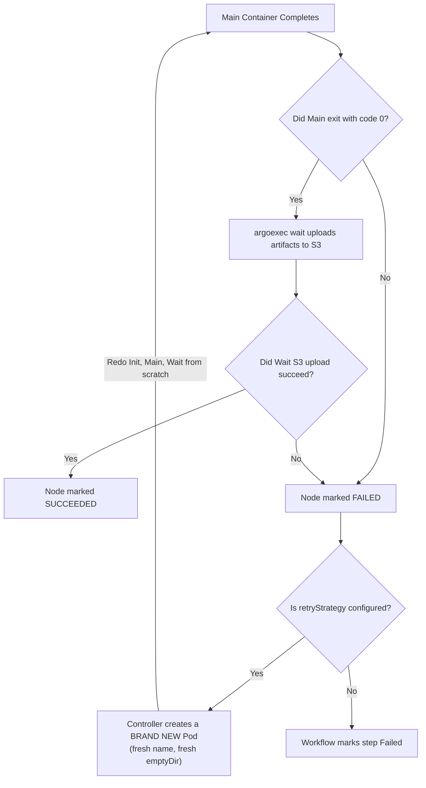

### Combined Container Exit Evaluation

The workflow controller does not determine node success solely based on the user's container exit code. It evaluates the execution status of all containers within the Pod:

- If the **Init container** fails (e.g., an S3 input artifact does not exist or credentials are invalid), the main container is never launched. The node is marked `Failed`.
- If the **Main container** exits with a non-zero code (e.g., Python uncaught exception or Linux OOMKill exit 137), the wait process captures the failure. Output artifacts are not uploaded. The node is marked `Failed`.
- If the **Main container** exits with code `0`, but the **Wait role** (`argoexec wait`) encounters a network drop or timeout during the S3 upload phase, **the entire Node is marked Failed**. Even though the machine learning model finished training successfully, the inability to persist output artifacts breaks downstream dependencies.

### Clean Pod Retry Semantics

In Argo Workflows, all step Pods are configured with `restartPolicy: Never`. 

When a step fails and has a `retryStrategy` defined:

- The failed Pod is never restarted in place. Kubernetes does not resurrect terminated containers inside an existing Pod sandbox.
- The workflow controller marks the failed Pod as an attempt (e.g., `step-name-1`).
- The controller creates an entirely new Pod object (e.g., `step-name-2`) with fresh resource allocations and a clean `emptyDir` scratch volume.
- The new Pod executes the complete lifecycle from the beginning: the init role re-downloads input artifacts, the main container re-runs the entire computation from scratch, and the wait role re-attempts the upload.

### Backoff Calculation and Non-Blocking Scheduling

When `retryStrategy.backoff` is defined, the `workflow-controller` does not block execution threads while waiting for a backoff window to expire:

1. **Deterministic Calculation**: The controller calculates the next retry delay using:
   `delay = min(duration * (factor ^ attempt_count), maxDuration)`
2. **Non-Blocking Delayed Timer**: Rather than sleeping or freezing execution threads (which would stall other workflows across the cluster), the controller registers a delayed timer for the failed step.
3. **Control Plane Concurrency**: While the delay counts down, the controller continues actively reconciling other independent pipelines across the cluster.
4. **Resumed Reconciliation**: Once the backoff window elapses, the controller re-evaluates the step, generates a fresh Pod manifest, and submits it to the Kubernetes API server.

---

## 6. Dynamic Fan-Out and Parallel Gather

Machine learning workflows frequently require executing dynamic data-parallel or hyperparameter-parallel tasks, where the number of concurrent executions is determined at runtime rather than hardcoded into the pipeline definition.

Argo implements dynamic fan-out using the `withParam` directive:

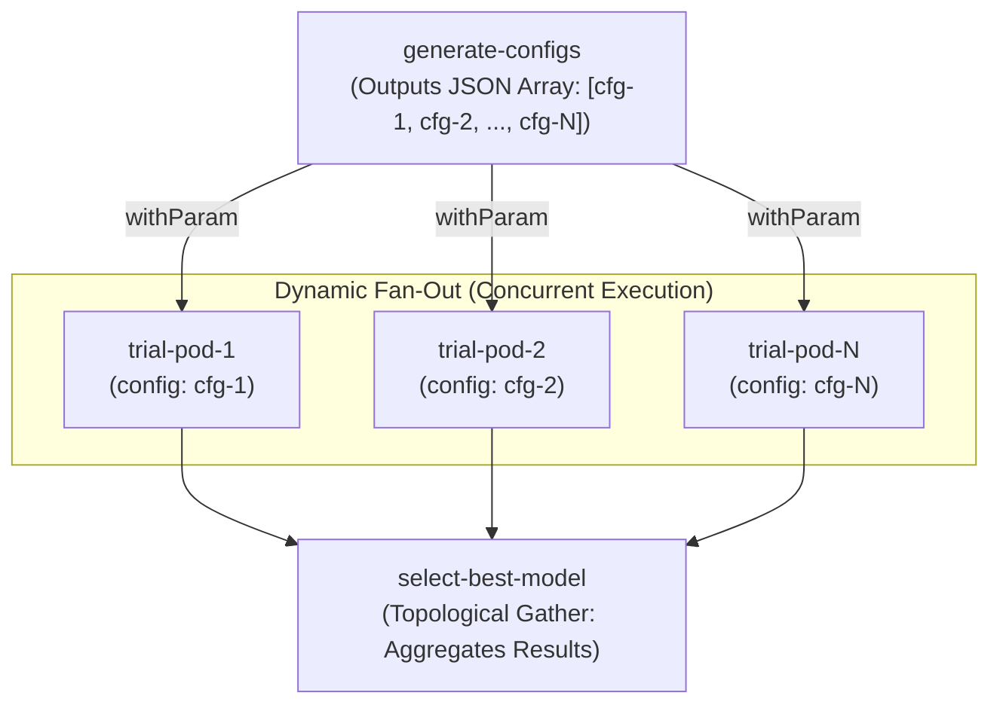

### The Fan-Out / Gather Lifecycle

1. **Parameter Resolution**: An upstream task outputs a JSON-encoded string representing a list of parameters (for example, a list of hyperparameter configurations or data chunk partitions):
   ```yaml
   - name: train-trials
     template: train-xgb-trial
     withParam: "{{tasks.generate-configs.outputs.result}}"
   ```
2. **Dynamic Manifest Synthesis**: During reconciliation, the workflow controller parses the JSON array. For each element, it dynamically generates an independent child Pod manifest, binding the item value into `{{item}}`.
3. **Cluster-Wide Parallel Scheduling**: The controller submits all child Pods to the Kubernetes API. The Kubernetes scheduler distributes them across available worker nodes according to cluster capacity and priority.
4. **Topological Gather**: Downstream tasks that declare a dependency on the fan-out task wait until all child Pods complete. The controller automatically aggregates output parameters from all successful children into a combined JSON array accessible via `{{tasks.train-trials.outputs.parameters}}`.

### Partial Failure Semantics and `failFast`

In exploratory hyperparameter sweeps, a single trial may crash due to an invalid configuration or localized out-of-memory error without invalidating the entire sweep:

- **Default Behavior (`failFast: false`)**: If a trial Pod fails, the controller marks that specific iteration as failed but allows all remaining sibling Pods to continue running to completion. The downstream gather step receives the outputs of all successful trials.
- **Fail-Fast Mode (`failFast: true`)**: If any child Pod fails, the controller immediately terminates all running sibling Pods and marks the entire DAG task as failed, conserving expensive GPU compute.

---

## 7. Conditional Execution Gates

In automated ML pipelines, execution flow often depends on dynamic data quality metrics or model validation results (for example, evaluating whether data drift exceeds an alert threshold, or whether a newly trained model outperforms the current production baseline).

Argo evaluates conditional logic using the `when:` expression:

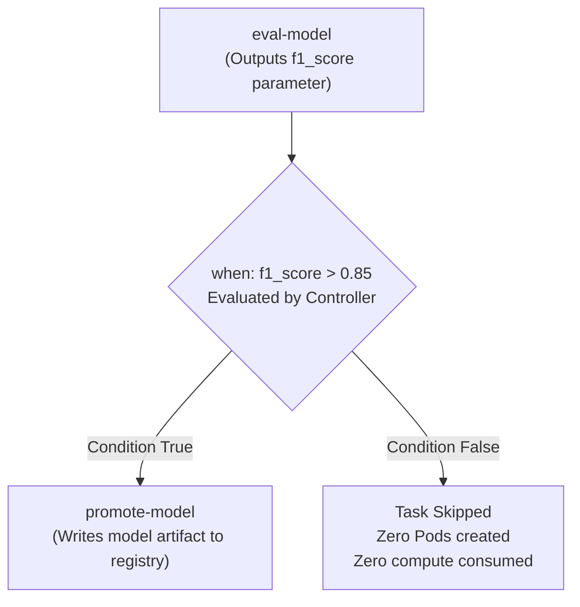

### Controller-Side Zero-Cost Branching

Unlike traditional workflow scripts where a container must start to evaluate a bash `if` statement, Argo evaluates `when:` conditions **entirely within the controller reconcile loop**:

```yaml
- name: promote-model
  template: promote-to-registry
  dependencies: [eval-model]
  when: "{{tasks.eval-model.outputs.parameters.f1-score}} > 0.85"
```

1. **Evaluation in Control Plane**: The controller reads the string value from `Workflow.status.nodes["eval-model"].outputs.parameters` and evaluates the boolean expression.
2. **Zero Compute Overhead**: If the condition evaluates to `false`, the controller records the node status as `Skipped`. No Pod is created, no container image is pulled, and zero cluster memory or CPU is consumed.
3. **DAG Advancement**: Downstream steps that depend on skipped tasks evaluate their own dependency conditions (for example, continuing on skip vs. requiring explicit success), allowing the pipeline to branch cleanly.

---

## 8. Human-in-the-Loop Validation Gates

In regulated machine learning environments, automated model promotion without human review introduces compliance and operational risks. Pipelines require a mechanism to pause execution, present evaluation metrics to an engineer or auditor, and wait for explicit approval before modifying production endpoints.

Argo implements this through the **`suspend` template**:

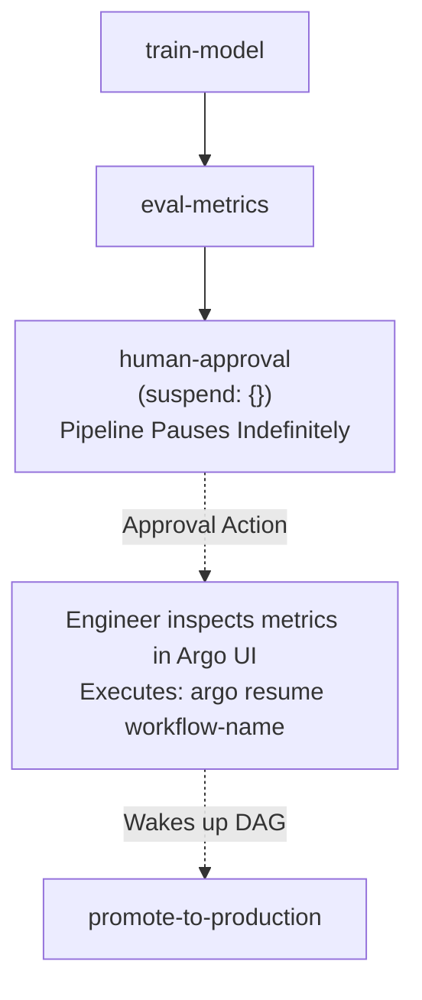

### The Suspend and Resume Mechanism

1. **Pause State**: When the DAG reaches a `suspend: {}` template, the workflow controller marks the node as `Suspended` in `etcd` and halts progression along that branch of the DAG.
2. **Zero Resource Footprint**: Unlike imperative polling scripts that keep a worker container running and sleeping, a suspended node creates **zero Pods**. No CPU, RAM, or worker node capacity is consumed while waiting for approval.
3. **Manual or Automated Resumption**: An authorized engineer inspects the model metrics and artifacts in the Argo Web UI and approves the step by clicking **Resume**, or runs:
   ```bash
   argo resume <workflow-name> -n argo
   ```
4. **Reconciliation Wakeup**: The resume command updates `Workflow.status` in the Kubernetes API server. During its next reconcile cycle, the controller detects the change, marks the suspend node as `Succeeded`, and immediately schedules the downstream promotion Pod.

---

## 9. Memoization Mechanics

Memoization allows an ML pipeline to skip redundant computations across independent workflow runs by caching successful step outputs.

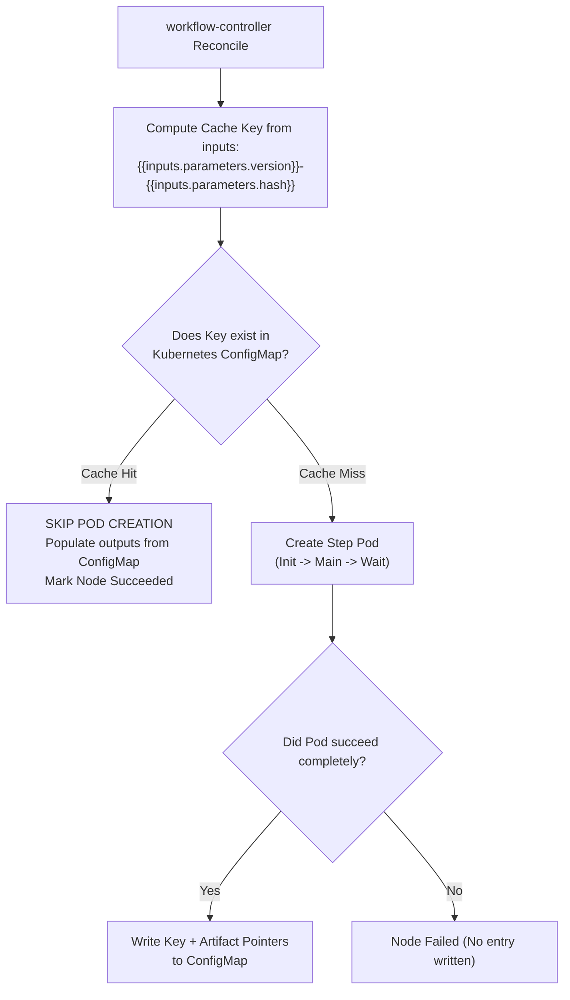

### Deterministic Key Evaluation

Memoization is declared at the template level:

```yaml
memoize:
  key: "{{inputs.parameters.dataset-hash}}-{{inputs.parameters.feature-config-version}}"
  maxAge: "72h"
  cache:
    configMap:
      name: feature-cache-store
```

1. **Pre-Scheduling Lookup**: Before generating a Pod manifest, the controller renders the `key` string using the step's resolved input parameters.
2. **ConfigMap Inspection**: The controller checks the specified ConfigMap. 
3. **Cache Hit Path**: If a key match is found and its creation timestamp falls within `maxAge`, the controller **skips Pod creation entirely**. It writes the cached artifact pointers directly into `Workflow.status.nodes[step].outputs` and immediately advances the DAG to the next step.
4. **Cache Miss Path**: If the key is absent, the step Pod is created and runs normally.
5. **Success-Only Write**: A new cache entry is written to the ConfigMap **only if the step reaches complete success**. If the user's code crashes or the wait container fails during upload, no cache record is stored. Subsequent attempts will re-execute the step rather than serving corrupted or missing outputs.
6. **Cross-Run Durability**: The cache ConfigMap does not carry an `ownerReferences` pointer to the Workflow that created it. Consequently, when old `Workflow` objects are deleted from the cluster by TTL garbage collection, the memoization ConfigMap remains untouched, allowing future workflows to reuse cached features.

!!! warning "Storage Compatibility with Memoization"
    Memoization caches pointers to step outputs (such as S3 artifact keys). It must always be backed by durable, permanent storage (such as object storage or pre-provisioned persistent volumes that outlive individual workflow runs). If memoization is paired with an ephemeral volume (`volumeClaimTemplates`), the volume will be deleted when the initial workflow finishes, leaving cached pointers pointing to nonexistent files in subsequent runs.

---

## 10. Synchronization: Mutexes and Semaphores

When multiple machine learning engineers trigger concurrent pipelines, shared cluster resources can become exhausted. For example, a cluster may only have 4 physical GPUs, or an external feature database may only support 5 concurrent extraction connections.

Argo provides concurrency control across separate, independent `Workflow` instances:

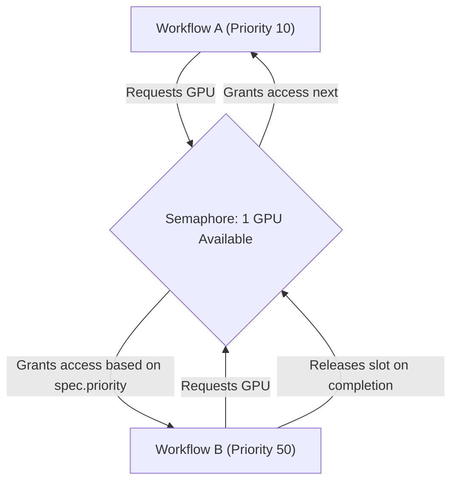

### Mutex vs. Semaphore

- **Mutex**: An exclusive lock granting access to exactly one step across the entire cluster.
- **Semaphore**: A counting lock granting access up to `N` concurrent holders. The limit `N` can be defined statically or read dynamically from a key within a ConfigMap.

### Scoping and Priority Queueing

Synchronization can be applied at two levels:

- **Workflow Scope (`spec.synchronization`)**: Locks the entire pipeline. Only one pipeline instance executes at a time.
- **Template Scope (`templates[].synchronization`)**: Locks only the resource-constrained step (e.g., the GPU training container), allowing unconstrained upstream steps (data extraction and CPU cleaning) to run in parallel.

When multiple workflows wait for an occupied lock, the controller does not use simple first-come, first-served ordering. Instead, it evaluates `Workflow.spec.priority`. A high-priority production retrain workflow (`priority: 100`) preempts pending exploratory experiments (`priority: 10`), claiming the next available lock slot.

---

## 11. The Distributed Training Boundary

A critical architectural distinction in machine learning infrastructure is the boundary between **workflow orchestration** and **distributed model training**.

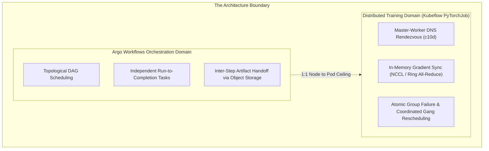

### The 1:1 Pod Ceiling of Argo Templates

Standard Argo template types (`container`, `script`) have an invariant architectural property:

`One DAG Node <==> Exactly One Kubernetes Pod`

There is no mechanism within native Argo templates to expand a single training task into a cooperating collective of N Pods that communicate with each other over the network during execution.

### Why Argo Alone Cannot Coordinate Distributed Training

Distributed model training algorithms (such as PyTorch DistributedDataParallel or Horovod) operate on fundamentally different principles than data pipelines:

1. **Inter-Process Rendezvous**: At startup, workers must discover each other. PyTorch DDP requires worker pods to connect to a designated `master-0` Pod at a known IP/DNS address and port to coordinate global world rank.
2. **Synchronous In-Memory Communication**: During backpropagation, workers execute NCCL all-reduce operations across physical nodes via high-speed network interfaces, synchronizing gradient tensors every few milliseconds.
3. **Atomic Group Failure Semantics**: If Worker 3 encounters a CUDA out-of-memory error or hardware bus fault, the training job on Workers 0, 1, and 2 cannot continue. They hang indefinitely waiting for Worker 3's gradient tensors. The entire collective must be terminated and restarted simultaneously.

Argo's failure model is node-independent: if one step in a parallel fan-out fails, Argo tracks that Pod alone. It has no primitive to signal sibling Pods to abort, nor can it restart a synchronized group with consistent rank assignments.

### The Solution: Delegation via Resource Templates to Kubeflow Training Operator

To execute multi-node distributed training within an Argo workflow, the pipeline delegates distributed group management to a specialized controller: the **Kubeflow Training Operator**.

```yaml
# Inside an Argo WorkflowTemplate: Delegating to PyTorchJob
- name: distributed-pytorch-training
  resource:
    action: create
    successCondition: status.conditions[?(@.type == "Succeeded")].status == "True"
    failureCondition: status.conditions[?(@.type == "Failed")].status == "True"
    manifest: |
      apiVersion: "kubeflow.org/v1"
      kind: "PyTorchJob"
      metadata:
        generateName: ddp-training-
      spec:
        pytorchReplicaSpecs:
          Master:
            replicas: 1
            restartPolicy: OnFailure
            template:
              spec:
                containers:
                  - name: pytorch
                    image: registry.internal/ml/ddp-model:v1.0
                    resources:
                      limits:
                        nvidia.com/gpu: 1
          Worker:
            replicas: 3
            restartPolicy: OnFailure
            template:
              spec:
                containers:
                  - name: pytorch
                    image: registry.internal/ml/ddp-model:v1.0
                    resources:
                      limits:
                        nvidia.com/gpu: 1
```

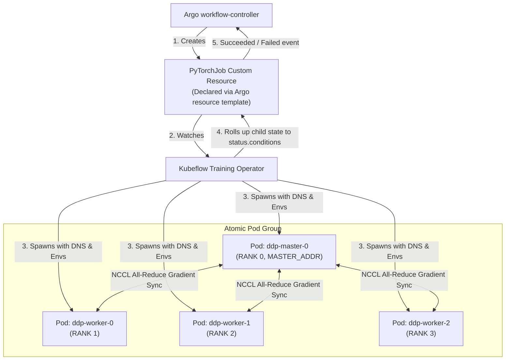

### Division of Responsibilities

When using the `resource` template pattern:

- **Argo Workflows** acts as the high-level macro-orchestrator. It schedules upstream ETL, passes the S3 path of the training dataset to the `PyTorchJob` manifest, watches the single `PyTorchJob` resource status, and unblocks downstream evaluation when training finishes.
- **The Kubeflow Training Operator** manages the micro-lifecycle of the distributed training collective:
  - It creates deterministic Pod hostnames (`ddp-master-0`, `ddp-worker-0`, etc.).
  - It establishes headless Kubernetes Services to provide stable internal DNS resolution.
  - It automatically injects environment variables (`RANK`, `WORLD_SIZE`, `MASTER_ADDR`, `MASTER_PORT`) into each Pod before scheduling.
  - It enforces **atomic group failure**: if one worker fails, the operator terminates all remaining workers, cleans up partial resources, and restarts the collective as a synchronized unit.

---

*(With these workflow orchestration mechanics established, the next section explores empirical benchmarks on partition skew, compaction, and S3 committers in [Data Movement at Scale](../experiments/data-movement.md)).*

---

### Official Documentation & Further Reading

- [Argo Workflows: Architecture and Controller Specifications](https://argoproj.github.io/argo-workflows/architecture/)
- [Argo Workflows: Workflow Executors Guide](https://argoproj.github.io/argo-workflows/workflow-executors/)
- [Argo Workflows: Dynamic Iteration with withParam](https://argoproj.github.io/argo-workflows/walk-through/iteration/)
- [Argo Workflows: Conditional Execution with when](https://argoproj.github.io/argo-workflows/walk-through/conditionals/)
- [Argo Workflows: Suspend and Resume Gates](https://argoproj.github.io/argo-workflows/walk-through/suspending/)
- [Argo Workflows: Configuring Artifact Repositories](https://argoproj.github.io/argo-workflows/configure-artifact-repository/)
- [Argo Workflows: Synchronization and Mutexes](https://argoproj.github.io/argo-workflows/synchronization/)
- [Kubeflow Training Operator Documentation](https://www.kubeflow.org/docs/components/training/)
- [Argo Workflows: Pod Cleanup and Garbage Collection](https://argoproj.github.io/argo-workflows/pod-cleanup/)
