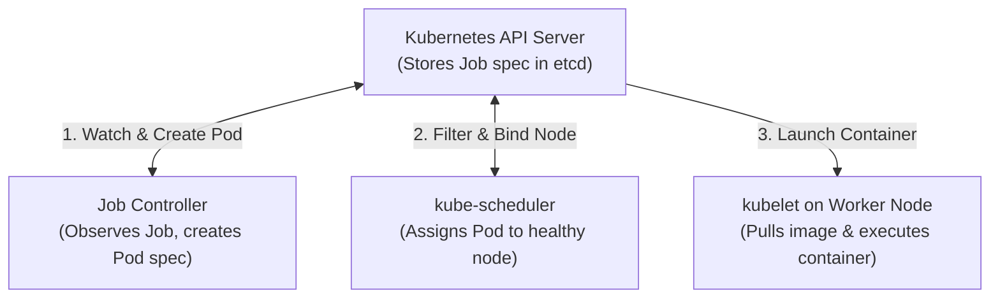
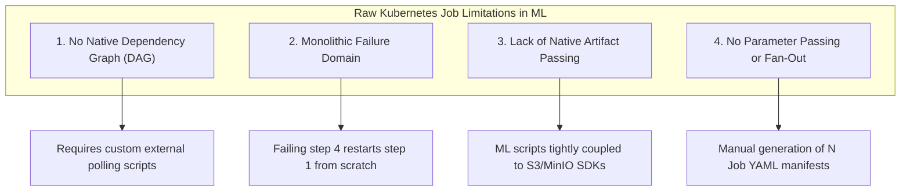
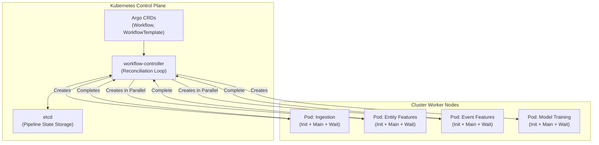
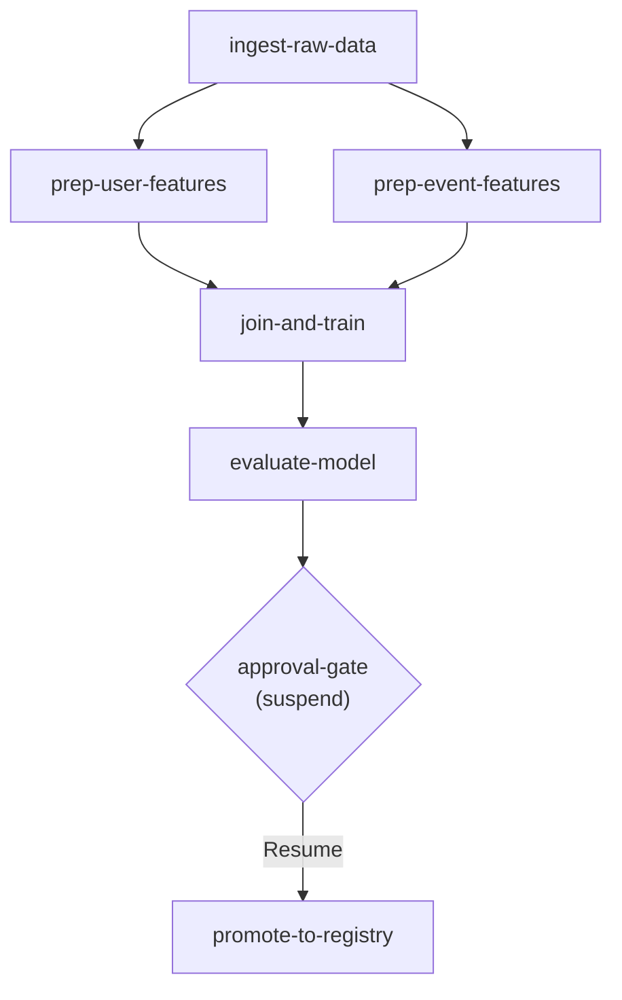
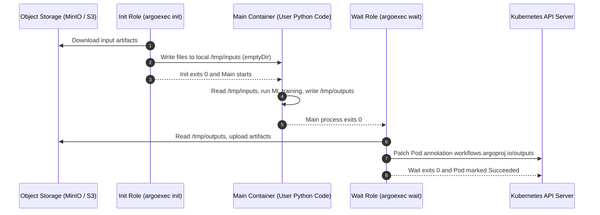
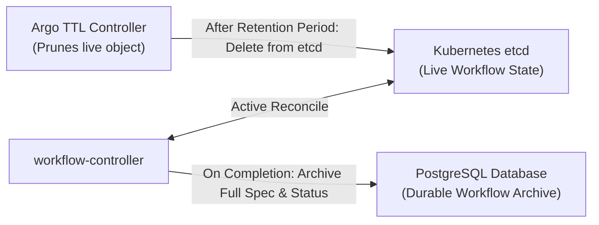
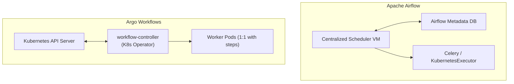

# Why Argo Workflows for ML Pipelines

Machine learning training systems require running complex, multi-stage computation graphs across distributed compute clusters. A production ML workflow is never a single monolithic script: it is a directed sequence of specialized operations with explicit data dependencies. Raw data must be ingested, validated, cleaned, transformed into feature matrices, partitioned into train and validation sets, fed into distributed model training algorithms, evaluated against performance thresholds, approved by human operators, and finally registered for deployment.

While container engines such as Docker package application dependencies into reproducible, portable environments, they operate exclusively on single physical machines. When workloads scale to multi-node clusters, Kubernetes becomes the substrate for scheduling and container lifecycle management. However, raw Kubernetes primitives lack the orchestration primitives needed to manage the end-to-end ML lifecycle. 

This document explains what raw Kubernetes provides, analyzes the mechanical gaps that emerge when attempting to run ML pipelines using native Kubernetes Jobs, and details how Argo Workflows operates as a Kubernetes-native orchestration layer to resolve these limitations.

---

## 1. What Kubernetes Provides as a Baseline

Kubernetes is a container orchestration platform designed primarily for resilient service hosting and basic batch execution. At its core, Kubernetes provides:

- **Distributed Scheduling**: The `kube-scheduler` places workloads across a cluster of worker nodes based on resource requests (CPU, memory, GPU) and node constraints (`nodeSelector`, node affinity, tolerations).
- **Process Isolation**: Containers run within Linux namespaces and cgroups, isolating compute, memory, and networking.
- **Declarative State Reconciliation**: The cluster continuously drives current state toward desired state using reconciliation loops executed by the `kube-controller-manager`.
- **The Kubernetes Job**: A built-in resource kind designed for run-to-completion batch workloads.



When you define a Kubernetes `Job`, you specify a container image, an execution command, resource requests, and a failure policy:

```yaml
apiVersion: batch/v1
kind: Job
metadata:
  name: model-training-step
spec:
  backoffLimit: 3
  template:
    spec:
      restartPolicy: Never
      containers:
        - name: trainer
          image: registry.internal/ml/xgboost-trainer:v2.1.0
          command: ["python", "train.py"]
          resources:
            requests:
              cpu: "8"
              memory: "32Gi"
              nvidia.com/gpu: "1"
            limits:
              cpu: "16"
              memory: "64Gi"
              nvidia.com/gpu: "1"
```

The Kubernetes `Job` controller ensures that the specified Pod runs until its primary container exits with status code `0`. If the container crashes with a non-zero exit code or the underlying worker node reboots, the Job controller creates replacement Pods up to the limit defined by `backoffLimit`. Once the Pod succeeds, the Job remains in a `Completed` state until garbage collected.

While this mechanism is effective for running single, independent batch tasks, it does not provide the coordination required for multi-step ML pipelines.

---

## 2. Why Multi-Step ML Pipelines Fail on Raw Kubernetes Jobs

Attempting to assemble a production ML pipeline from raw Kubernetes Jobs exposes four fundamental architectural limitations.



### Gap 1: No Dependency Graph (DAG) or Topological Sorting

A machine learning pipeline is an acyclic graph of interdependent tasks:

- Feature extraction for entity profiles and event records must finish before building the training spine.
- The spine and label generation must complete before matrix assembly.
- Matrix assembly must complete before model training can consume the dataset.

Raw Kubernetes Jobs are completely isolated objects in `etcd`. Job B has no native awareness of Job A. Kubernetes provides no field within `batch/v1 Job` to declare `dependsOn: [job-a]`. 

To coordinate dependencies using raw Jobs, teams must build and maintain an external supervisor:

1. A custom script runs on an external VM or bastion host outside the cluster.
2. The script submits the manifest for Job A via the Kubernetes API.
3. The script enters an active polling loop, querying `GET /apis/batch/v1/namespaces/{ns}/jobs/job-a` every 10 seconds.
4. When Job A reaches `status.succeeded == 1`, the script generates and submits the manifest for Job B.
5. If the supervisor script crashes, loses network connectivity, or experiences a host reboot, the pipeline becomes orphaned. The cluster continues running orphaned Pods with no system tracking overall pipeline state.

### Gap 2: Monolithic Failure Domains and Coarse Error Recovery

Because raw Jobs do not natively chain together, engineers often bundle multiple pipeline phases into a single container image or run them sequentially within a single Job script:

```bash
# monolithic_pipeline.sh inside a single raw Job container
python extract_data.py       # Takes 2 hours
python clean_features.py     # Takes 1 hour
python generate_labels.py    # Takes 45 minutes
python train_model.py        # Takes 3 hours
python evaluate_model.py     # Fails due to metric schema mismatch!
```

If `evaluate_model.py` crashes due to a transient network error or schema mismatch, the Job controller's `backoffLimit` restarts the container from the very beginning. The pipeline re-executes data extraction, feature cleaning, label generation, and three hours of GPU training, wasting compute resources and delaying iteration.

Conversely, if the steps are split into separate raw Jobs managed by an external script, Kubernetes cannot perform partial pipeline retries. If Job 4 fails, recovering requires manual intervention to query the state of earlier Jobs, construct a partial execution plan, and trigger downstream Jobs by hand.

### Gap 3: No Native Artifact Passing

In an ML pipeline, the output of one stage is almost always a file artifact: a Parquet partition, a serialized feature preprocessor, a model weight matrix (`model.json` or `checkpoint.pt`), or an evaluation metrics payload.

Kubernetes Pods are scheduled dynamically across distinct physical nodes. Pod A (running feature engineering) may execute on Node 1, while Pod B (running model training) is scheduled on Node 2 because Node 2 has an available GPU. Node 1 and Node 2 do not share a local filesystem.

To hand data between steps using raw Jobs:

- The data science training script must import cloud storage client libraries (`boto3`, `google-cloud-storage`, or the MinIO SDK).
- The script must read environment variables for bucket names, S3 endpoints, and access credentials.
- The script must explicitly implement upload and download routines with error handling, checksum validation, and local scratch directory management.

```python
# train.py coupled to infrastructure plumbing
import boto3
import os
import xgboost as xgb

# Infrastructure boilerplate inside ML code
s3 = boto3.client(
    "s3",
    endpoint_url=os.environ["S3_ENDPOINT"],
    aws_access_key_id=os.environ["AWS_ACCESS_KEY_ID"],
    aws_secret_access_key=os.environ["AWS_SECRET_ACCESS_KEY"]
)
s3.download_file("ml-artifacts", "features/train_matrix.parquet", "/tmp/train.parquet")

# Actual ML logic
dtrain = xgb.DMatrix("/tmp/train.parquet")
bst = xgb.train({"tree_method": "hist"}, dtrain)
bst.save_model("/tmp/model.json")

# More infrastructure boilerplate
s3.upload_file("/tmp/model.json", "ml-artifacts", "models/candidate.json")
```

This pattern pollutes clean machine learning logic with cloud infrastructure SDKs, makes local testing outside the cluster difficult, and introduces security risks by requiring storage credentials to be mounted directly inside user-facing training containers.

### Gap 4: No Parameter Passing or Dynamic Fan-Out

Machine learning workflows frequently require evaluating multiple configurations in parallel. Examples include:

- Running hyperparameter optimization across learning rates `[0.01, 0.05, 0.10]` and tree depths `[4, 6, 8]`.
- Processing data in parallel across 10 independent regional entity partitions.

Kubernetes Jobs support an `indexed` completion mode where each Pod receives an index from `0` to `completions - 1`. However:

- It cannot ingest dynamic parameter lists computed by an upstream step (such as a list of active entity dates identified during data extraction).
- It cannot pass distinct strings or complex parameter objects to specific workers.
- It provides no mechanism to collect and aggregate outputs from parallel workers into a subsequent evaluation step.

To implement hyperparameter tuning using raw Jobs, engineers must write templating scripts that render multiple Job manifests, submit them concurrently, monitor their completion statuses independently, and write custom aggregation logic to find the winning trial.

---

## 3. What Argo Workflows Adds as a Kubernetes-Native Layer

Argo Workflows is an open-source workflow orchestration engine implemented as a Kubernetes Custom Controller. Instead of running outside the cluster as a centralized daemon, Argo extends the Kubernetes control plane by registering Custom Resource Definitions (CRDs).



### The Custom Controller Pattern

When Argo Workflows is installed, it registers custom resource kinds including `Workflow`, `WorkflowTemplate`, `CronWorkflow`, and `ClusterWorkflowTemplate` with the Kubernetes API server. 

The Argo `workflow-controller` runs as a standard Kubernetes Deployment. Like built-in controllers (such as the ReplicaSet or Job controller), it implements an autonomous reconcile loop:

1. It watches the Kubernetes API server for additions, updates, or deletions of `Workflow` objects and labeled workflow Pods.
2. When a `Workflow` resource is submitted, the controller reads the pipeline definition, computes the dependency graph, identifies tasks that have all prerequisites satisfied, and issues standard Kubernetes API calls to create individual Pods for those steps.
3. As Pods change phase (`Pending -> Running -> Succeeded / Failed`), the controller receives event notifications, updates the internal execution graph stored in the `Workflow.status` field in `etcd`, and schedules subsequent unblocked steps.

Because pipeline state is persisted directly within Kubernetes custom resources in `etcd`, the workflow controller is completely stateless. If the controller pod crashes or is rescheduled during a long-running training job, its replacement immediately reconstructs the pipeline state from `etcd` and resumes execution without interrupting running worker Pods.

### Native DAG and Steps Execution Models

Argo Workflows provides two declarative execution models: `steps` (sequential or parallel lists of steps) and `dag` (explicit graph definitions). The `dag` structure is standard for ML pipelines:

```yaml
apiVersion: argoproj.io/v1alpha1
kind: WorkflowTemplate
metadata:
  name: ml-training-pipeline
spec:
  entrypoint: training-dag
  templates:
    - name: training-dag
      dag:
        tasks:
          - name: ingest-raw-data
            template: ingest-task
          
          - name: prep-user-features
            template: user-features-task
            dependencies: [ingest-raw-data]
            
          - name: prep-event-features
            template: event-features-task
            dependencies: [ingest-raw-data]
            
          - name: join-and-train
            template: train-task
            dependencies: [prep-user-features, prep-event-features]
            arguments:
              artifacts:
                - name: user-data
                  from: "{{tasks.prep-user-features.outputs.artifacts.features}}"
                - name: event-data
                  from: "{{tasks.prep-event-features.outputs.artifacts.features}}"

          - name: evaluate-model
            template: eval-task
            dependencies: [join-and-train]
            arguments:
              artifacts:
                - name: model
                  from: "{{tasks.join-and-train.outputs.artifacts.model}}"

          - name: approval-gate
            template: human-review
            dependencies: [evaluate-model]

          - name: promote-to-registry
            template: promote-task
            dependencies: [approval-gate]
```

The workflow controller computes the topological sort of this graph. Tasks with no dependencies (`ingest-raw-data`) execute immediately. Once `ingest-raw-data` succeeds, the controller detects that both `prep-user-features` and `prep-event-features` have their dependencies met and launches both Pods concurrently. 

`join-and-train` is blocked until both parallel feature tasks reach `Succeeded`.



### Automated Artifact Management: Separating User Code from Storage Protocols

Argo Workflows eliminates the need to embed cloud storage SDKs (`boto3`, `google-cloud-storage`) inside ML training code. Instead, Argo coordinates artifact movement around your container using a single helper tool: the **`argoexec` executor**.

Within each pipeline step, there are fundamentally only two workloads:
1. **The User Application (`main`)**: Your unmodified Python/ML code running inside its standard container.
2. **The Argo Executor (`argoexec`)**: A single lightweight Go binary injected by Argo to handle cloud storage operations before and after your code executes.

Because Kubernetes enforces strict container lifecycles (init containers must finish before application containers start), `argoexec` operates across two lifecycle roles coordinated via a local Pod-level `emptyDir` scratch volume:

- **The Init Role (`argoexec init`)**: Runs as a Kubernetes init container. It downloads declared input artifacts from MinIO/S3 into `/tmp/inputs` on the shared volume, then exits `0`.
- **The Main Execution**: The user container starts only after inputs are ready on local disk. Your script reads from `/tmp/inputs`, fits models, and writes results to `/tmp/outputs` using plain POSIX file calls (`open()`, `pd.read_parquet()`).
- **The Wait Role (`argoexec wait`)**: Once the main process completes, `argoexec` reads output files from `/tmp/outputs`, uploads them to object storage, and notifies the Kubernetes API server.



The user's code simply reads from `/tmp/inputs` and writes to `/tmp/outputs`. Machine learning researchers write standard Python code that interacts exclusively with the local filesystem, keeping data science logic cleanly separated from cloud storage protocols.

### Step-Level Retry with Exponential Backoff

In a raw Kubernetes Job, failure handling is all-or-nothing: if a container fails, Kubernetes restarts the entire Job from step 1, discarding hours of completed preprocessing. Argo Workflows isolates retries to the exact step that failed, allowing you to configure **exponential backoff** to handle transient network hiccups, spot node evictions, and overloaded storage systems gracefully.

```yaml
retryStrategy:
  limit: 3
  retryPolicy: OnFailure
  backoff:
    duration: "30s"
    factor: 2
    maxDuration: "5m"
```

#### How Exponential Backoff Works in Practice

When a failure occurs, immediate retries can worsen cluster instability. If an S3 object store or feature service is struggling under heavy read load, retrying instantly creates a "thundering herd" storm of repeated requests that keeps the service down.

Exponential backoff spaces each subsequent retry progressively further apart using the formula:

`retry_delay = min(duration * (factor ^ attempt_index), maxDuration)`

Given the configuration above, Argo schedules retry attempts along this progression:

| Attempt | Status | Delay Before Next Run | Calculation | Effective Wait Time |
| :--- | :--- | :--- | :--- | :--- |
| **Initial Run** | Fails (e.g., S3 timeout) | 30s | `30s * (2 ^ 0)` | Waits 30 seconds |
| **Retry 1** | Fails again | 60s | `30s * (2 ^ 1)` | Waits 1 minute |
| **Retry 2** | Fails again | 120s | `30s * (2 ^ 2)` | Waits 2 minutes |
| **Retry 3** | Final attempt | - | - | Fails step if unsuccessful |

If additional retries were allowed, the delay would continue doubling until reaching `maxDuration: "5m"`, where it caps to prevent tasks from waiting indefinitely.

#### Choosing the Right Retry Policy

Argo allows engineering teams to control which failures trigger a retry:

- **`OnFailure`**: Retries whenever a container exits with a non-zero status code (e.g., application crashes, transient network drops, or Linux OOMKill exit 137).
- **`OnTransientError`**: Retries exclusively on infrastructure-level disruptions (e.g., Kubernetes spot node preemptions, network RPC timeouts, or Pod eviction). If your Python code throws an unhandled `ValueError` or broken model import, Argo will not waste expensive GPU compute retrying code that will deterministically fail.
- **`Always`**: Retries on any failure, regardless of exit status.

When a step fails and retries, all succeeded upstream tasks (such as two hours of feature extraction) remain intact in object storage. Argo provisions a fresh Pod with a clean `emptyDir` scratch volume, waits for the backoff window to elapse, and resumes execution seamlessly.

### Human-in-the-Loop Validation Gates (`suspend`)

Machine learning workflows frequently require operational or safety checks before promoting models to production:

```yaml
- name: human-review
  suspend: {}
```

When execution reaches a `suspend` template, the workflow controller creates no Pods, consuming zero cluster compute resources. The workflow enters a `Suspended` phase. Engineers can inspect evaluation metrics logged to tracking servers or artifact buckets. Once satisfied, an operator or automated CI/CD pipeline issues:

```bash
argo resume <workflow-name>
```

This updates the `Workflow` resource in `etcd`, unblocking downstream deployment steps.

### Step Memoization via ConfigMaps

Feature engineering and data preparation jobs are compute-intensive. When experimenting with model hyperparameters, data scientists frequently rerun workflows where the upstream feature generation inputs have not changed.

Argo implements deterministic step caching via memoization:

```yaml
memoize:
  key: "{{inputs.parameters.dataset-version}}-{{inputs.parameters.feature-hash}}"
  maxAge: "168h"
  cache:
    configMap:
      name: feature-engineering-cache
```

Before creating a Pod for a task, the workflow controller renders the `key` expression and queries the specified Kubernetes ConfigMap. 

- **Cache Hit**: If an entry exists for that key, Argo skips Pod creation entirely. It marks the step `Succeeded` immediately and populates output artifact pointers directly from the ConfigMap. Downstream steps run without delay.
- **Cache Miss**: Argo creates the Pod, executes the workload, and writes the resulting output artifact pointers to the ConfigMap upon successful completion.

### Durable Workflow Archive in PostgreSQL

Kubernetes `etcd` is an in-memory, Raft-replicated key-value store with a strict 2 GB to 8 GB database size ceiling. To prevent cluster degradation, completed Kubernetes objects must be pruned periodically.

When running hundreds of ML training runs across an organization, retaining a permanent history of pipeline executions, parameter values, code versions, and artifact references is mandatory for reproducibility and governance.

Argo Workflows provides an automated Workflow Archive service backed by an external PostgreSQL database:



When a workflow completes, the controller persists the entire workflow specification, resolved parameters, step execution timestamps, and output artifact metadata to PostgreSQL. When the live `Workflow` custom resource is subsequently deleted from `etcd` by TTL controllers, its historical record remains queryable via the Argo CLI and Web UI.

### Observability and Out-of-Memory (OOM) Detection

ML pipelines are prone to system-level resource failures, particularly Linux Out-of-Memory kills (exit code 137) when loading massive DataFrames or training wide tree ensembles.

In raw Kubernetes, debugging why a container exited requires querying `kubectl describe pod` before the Pod is deleted, scanning raw system logs, and correlating termination reasons manually.

Argo Workflows provides:

- An interactive Web UI visualizing active and historical DAG runs with real-time step status indicators.
- Unified multi-container log streaming that allows switching between the user's `main` container, the `init` data downloader, and the `wait` artifact uploader.
- Explicit detection and highlighting of container `OOMKilled` events directly on DAG nodes, allowing engineers to diagnose memory exhaustion instantly.

---

## 4. Comprehensive Comparison: Raw Kubernetes Jobs vs Argo Workflows

The following table summarizes the structural differences between raw Kubernetes Jobs and Argo Workflows across every core ML infrastructure requirement.

| ML Pipeline Requirement | Raw Kubernetes Jobs | Argo Workflows |
| :--- | :--- | :--- |
| **Dependency Graph (DAG)** | None. Jobs are isolated primitives. Requires custom external polling scripts to chain steps. | Native. Declarative `dag.tasks` and `dependencies` with automatic topological sorting. |
| **Concurrency Management** | Manual. External supervisor must track node capacity and throttle Job creation. | Automated. Unblocked graph nodes run in parallel automatically up to configured limits. |
| **Artifact Handoff** | None. Storage code (`boto3`, MinIO SDK) must be hardcoded inside ML training scripts. | Automated. Managed `argoexec` lifecycle roles move files via object storage and `emptyDir` volumes. |
| **Step-Level Retries** | Pod-level restarts only. A multi-stage script failure restarts the entire container from step 1. | Fine-grained. `retryStrategy` retries only the failed step with configurable backoff and duration limits. |
| **Parameter Passing** | Manual. Requires custom templating to inject parameters into container args or env vars. | Native. Declarative `inputs.parameters` and `outputs.parameters` passed between steps automatically. |
| **Dynamic Fan-Out** | Fixed `indexed` mode only. Cannot fan out over dynamic lists computed at runtime. | Dynamic. `withParam` expands a runtime list into N parallel, individually tracked step Pods. |
| **Step Caching (Memoization)** | None. Every Job run executes from scratch regardless of whether inputs changed. | Built-in. ConfigMap-backed memoization skips Pod execution on cache hits. |
| **Human Approval Gates** | None. Requires building external webhook listeners or custom ticketing integrations. | Native. `suspend` templates pause pipeline execution with zero compute consumption until resumed. |
| **Audit and Run History** | Ephemeral. Once a Job is deleted from `etcd`, all execution history and logs are lost. | Durable. Workflow Archive automatically persists full run history and metadata to PostgreSQL. |
| **Observability and UI** | Basic CLI (`kubectl`). Diagnosing failure causes requires manual log and event inspection. | Comprehensive Web UI with visual DAG tracking, multi-container logs, and explicit OOMKill indicators. |
| **Failure Blast Radius** | High. An orchestration script failure abandons running Jobs without tracking state. | Minimal. State resides in `etcd`; the controller is crash-resilient and self-healing. |

---

## 5. Architectural Comparison with Alternatives

When designing machine learning infrastructure on top of Kubernetes, two common workflow alternatives are Apache Airflow and Kubeflow Pipelines.



### Apache Airflow vs Argo Workflows

Apache Airflow is a general-purpose data orchestration system that originated in traditional enterprise data warehousing. While Airflow can interact with Kubernetes via the `KubernetesPodOperator`, its underlying architecture reflects a VM-centric model:

- **Centralized Scheduler**: Airflow relies on a persistent scheduler process running on a dedicated host or container. The scheduler continuously executes Python DAG definitions, queries a central relational database (PostgreSQL/MySQL), and places tasks into an execution queue.
- **Scheduler Polling Latency**: Airflow tasks undergo a multi-hop scheduling process (Scheduler loop -> DB state write -> Executor dispatch -> Worker pick-up). In high-throughput pipelines with hundreds of fast-running tasks, Airflow can introduce multi-second scheduling delays between dependent tasks.
- **Container Lifecycle Integration**: In Airflow, Kubernetes is merely an execution target reached via external API calls. In contrast, Argo Workflows is a native Kubernetes controller. Every workflow step is an actual Kubernetes Pod managed directly by the cluster control plane. Argo uses Kubernetes-native events, RBAC, service accounts, and admission controllers with zero architectural translation layer.

!!! note "Operational Tradeoff"
    Airflow is well-suited for organization-wide business intelligence workflows that orchestrate external SaaS systems, cloud data warehouses (Snowflake, BigQuery), and legacy batch databases. Argo Workflows is architecturally superior for compute-heavy, containerized ML pipelines where tasks run natively inside the Kubernetes cluster.

### Kubeflow Pipelines (KFP) vs Argo Workflows

Kubeflow Pipelines is an ML-specific orchestration framework that provides a high-level Python SDK (`kfp`) and experiment tracking dashboards. Under the hood, Kubeflow Pipelines historically utilized Argo Workflows as its core execution engine (with modern versions also supporting Tekton):

- **Platform Footprint**: Deploying Kubeflow Pipelines requires installing an extensive ecosystem of supporting microservices, including Istio service meshes, multi-user authentication proxies, Katib, Envoy gateways, and multiple metadata tracking services. 
- **Operational Complexity**: Maintaining KFP requires substantial platform engineering overhead to manage version upgrades, service-to-service security boundaries, and custom storage drivers.
- **Architectural Abstraction**: KFP compiles Python functions into intermediate pipeline specifications, which are then converted into lower-level workflow manifests. When pipeline steps fail, debugging issues requires tracing through multiple abstraction layers.

Using Argo Workflows directly provides the exact orchestration capabilities required for production ML (DAG dependencies, parameter fan-out, artifact management, hardware routing, and failure handling) without the operational burden of managing a massive, opinionated platform suite.

---

## 6. Summary

A container engine isolates an application's code and runtime environment, while Kubernetes automates the scheduling of containers across a cluster of worker nodes. However, raw Kubernetes Jobs are isolated batch execution units that lack the concepts of dependency graphs, pipeline-level failure domains, transparent artifact passing, and human review gates.

Argo Workflows provides this missing orchestration layer natively within the Kubernetes control plane. By extending the Kubernetes API with custom workflow resources and automating artifact transport via the `argoexec` executor lifecycle, Argo enables engineering teams to define, execute, and monitor resilient, production-grade machine learning pipelines without coupling data science code to cluster infrastructure.

*(This operational transition is explored in detail in the next section: [Argo Workflows Internals](internals.md)).*

---

### Official Documentation & Further Reading

- [Argo Workflows Official Documentation](https://argoproj.github.io/argo-workflows/)
- [Argo Workflows: Workflow CRD Specification](https://argoproj.github.io/argo-workflows/fields/#workflow)
- [Argo Workflows: Step-Level Retry Strategies](https://argoproj.github.io/argo-workflows/fields/#retrystrategy)
- [Argo Workflows: Workflow Architecture Overview](https://argoproj.github.io/argo-workflows/architecture/)
- [Apache Airflow Documentation](https://airflow.apache.org/docs/)
- [Kubeflow Pipelines Documentation](https://www.kubeflow.org/docs/components/pipelines/)
