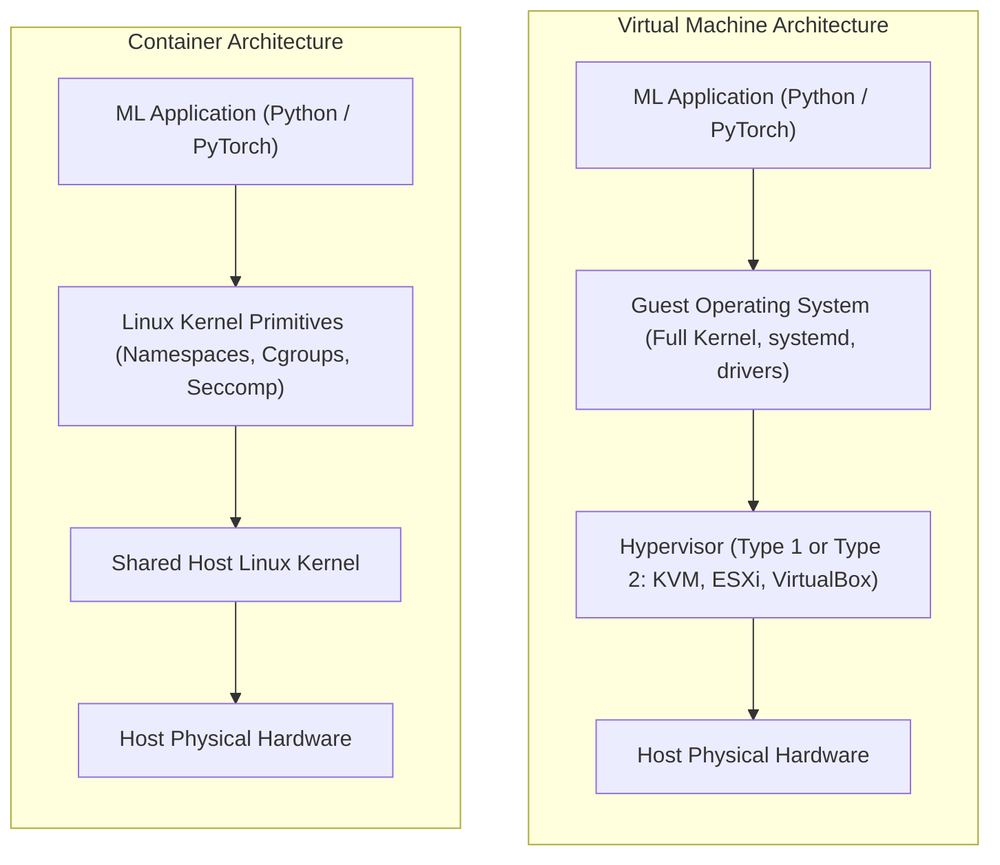
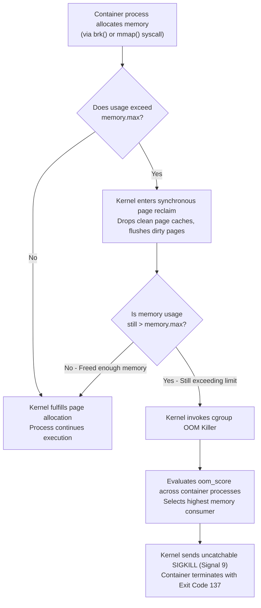
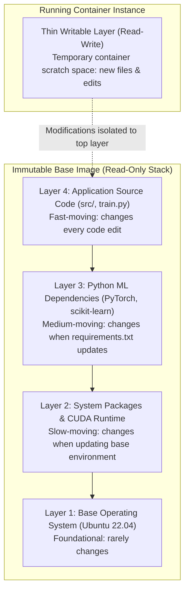
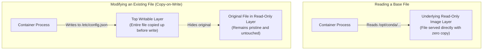
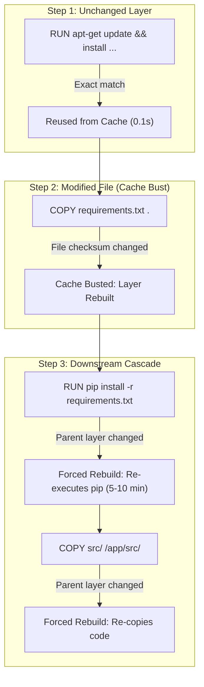
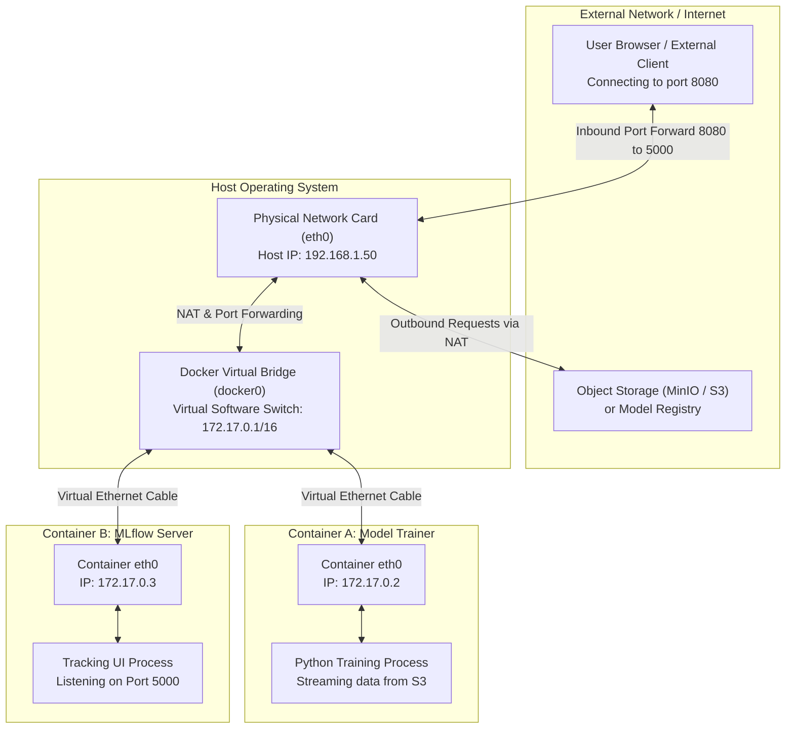

# Docker Mechanics: Container Isolation and Runtime Primitives

In distributed machine learning, reproducibility is a strict operational requirement. An ML training pipeline might run data preprocessing on a 16-core CPU machine, model training across four GPU nodes, and model evaluation on a separate inference benchmark server.

If each server relies on manually installed Python interpreters, system-level CUDA drivers, and package dependencies, the pipeline will inevitably experience environment drift:
- Code fails because Node A runs Python 3.10 while Node B runs Python 3.11.
- A C-extension or linear algebra library (`OpenBLAS`, `MKL`) compiled against specific CPU instructions is missing on another node.
- A transitive dependency mismatch produces silent numerical divergence during gradient updates.

Docker solves this challenge by packaging an application, its system libraries, runtime environment, and configuration into an immutable, portable unit called a **container image**. 

To use containers effectively in production infrastructure, one must understand how they operate at the Linux kernel level: how process isolation is enforced, how resources are constrained, and how copy-on-write storage functions under the hood.

---

## Containers vs. Virtual Machines

Both Virtual Machines (VMs) and containers provide isolated execution environments, but they achieve isolation at fundamentally different layers of the computing stack.



### Hypervisors vs. Shared Host Kernel

1. **Virtual Machines**:
   - A Virtual Machine relies on a **hypervisor** (such as KVM, Xen, or ESXi). The hypervisor emulates physical hardware (virtual CPUs, virtual RAM, virtual network interfaces, and virtual storage controllers).
   - On top of this emulated hardware, the VM runs a complete **Guest Operating System**, including its own Linux kernel, system initialization daemon (`systemd`), device drivers, and background daemons.
   - **Overhead**: Running a guest kernel requires hundreds of megabytes to gigabytes of dedicated RAM just to boot the OS. Starting a VM takes tens of seconds to minutes. Hardware instruction translation through the hypervisor introduces CPU and I/O virtualization overhead.
2. **Containers**:
   - A container has **no kernel of its own**. It shares the host machine's Linux kernel directly.
   - A container process is fundamentally an **ordinary host Linux process** executing in user space, but wrapped in operating system boundary controls that restrict what it can see, what resources it can consume, and which system calls it can execute.
   - **Overhead**: Because there is no guest kernel to boot and no hardware to emulate, containers launch in milliseconds. Container processes execute machine instructions directly on host CPU cores with zero virtualization penalty.

!!! note "What About Docker Desktop on macOS and Windows?"
    The Linux kernel primitives that make containers possible (namespaces and cgroups) exist exclusively in Linux. When running Docker Desktop on macOS or Windows, Docker transparently runs a lightweight, headless Linux virtual machine in the background. The Docker CLI on the host communicates with the Docker daemon running inside that Linux VM, and your containers execute within the VM's shared Linux kernel.

---

## Linux Namespaces: The Visibility Boundary

A container's illusion of having its own dedicated operating system is created by **Linux Namespaces**. Namespaces restrict **what a process can see** by partitioning global kernel resources into discrete, isolated views.

The Linux kernel implements six core namespaces utilized by container runtimes:

| Namespace | Kernel Flag | What It Isolates |
|---|---|---|
| **PID** | `CLONE_NEWPID` | Process IDs. A container process sees itself as PID 1, while having an ordinary PID on the host. |
| **NET** | `CLONE_NEWNET` | Network devices, IP routing tables, firewall rules, port bindings, and sockets. |
| **MNT** | `CLONE_NEWNS` | Filesystem mount points. Isolates the container's root directory (`/`) from the host filesystem. |
| **IPC** | `CLONE_NEWIPC` | Inter-Process Communication resources: System V IPC message queues, semaphores, and POSIX shared memory. |
| **UTS** | `CLONE_NEWUTS` | System identifiers: Hostname and NIS domain name. |
| **USER** | `CLONE_NEWUSER` | User and Group IDs. Allows a process to run with UID 0 (root) inside the container while mapping to an unprivileged UID on the host. |

### The Mechanics of Process Isolation

When you run an ML training script inside a container:

```bash
docker run -it python:3.10 python train.py
```

Inside the container, inspecting the process tree reveals:

```text
# Inside container namespace
PID   USER     TIME   COMMAND
  1   root     0:02   python train.py
```

However, if you inspect the host operating system's process table simultaneously, you see the exact same process:

```text
# On host operating system
PID     USER     TIME   COMMAND
48291   root     0:02   python train.py
```

The process is not executing in a separate machine. It is executing directly on the host kernel. The kernel's PID translation layer maps PID `48291` in the root PID namespace to PID `1` inside the container's private PID namespace. Because PID 1 is isolated, the process cannot inspect, signal, or terminate any process outside its own namespace.

### The System Calls Behind Namespaces

Container runtimes (such as `runc`, which Docker and containerd invoke) configure namespaces using three low-level Linux system calls:

1. **`clone()`**: Spawns a new child process similar to `fork()`, but accepts bitwise flags specifying which namespaces to create for the child (e.g., `clone(..., CLONE_NEWPID | CLONE_NEWNET | CLONE_NEWNS)`).
2. **`unshare()`**: Disassociates the calling process from its current parent namespaces and moves it into newly initialized namespaces without spawning a child.
3. **`setns()`**: Attaches the calling process to an already existing namespace identified by an open file descriptor in `/proc/<PID>/ns/`. This syscall is the exact mechanism used by `docker exec`: it attaches a new shell process to the existing namespaces of a running container.

---

## Linux Cgroups (Control Groups): Resource Constraints

While namespaces control **what a process can see**, Linux **Cgroups (Control Groups)** control **what resources a process can consume**.

Without cgroups, a single runaway Python training process could allocate all system RAM, causing the host operating system to freeze and crashing adjacent services. Modern container runtimes rely on **cgroups v2**, which organizes processes into a unified, hierarchical filesystem tree located under `/sys/fs/cgroup/`.

Inside a container's cgroup directory, the kernel exposes controller files that enforce resource quotas:

```text
/sys/fs/cgroup/docker/<container-id>/
  ├── cpu.max         # CPU bandwidth quota
  ├── cpu.weight      # Relative CPU scheduling priority
  ├── memory.max      # Hard memory limit (triggers OOM kill)
  ├── memory.high     # High watermark memory throttle
  └── memory.current  # Real-time memory consumption
```

### CPU Limits: Throttling, Not Killing

CPU constraints are governed by the `cpu.max` file, which defines bandwidth limits using two values: **quota** and **period** (in microseconds):

```text
# Allow 2 CPU cores of compute time every 100ms period
# 200,000 microseconds / 100,000 microseconds = 2.0 CPUs
echo "200000 100000" > /sys/fs/cgroup/docker/<container-id>/cpu.max
```

When a container runs CPU-intensive operations (such as data normalization or image augmentation), the kernel's Completely Fair Scheduler (CFS) tracks the container's CPU run time. Once the container consumes its allotted 200ms of CPU time within a 100ms window, the scheduler unschedules the process threads. The process is **throttled** until the current period expires, running slower but remaining alive.

### Memory Limits and the OOM Kill Sequence

Memory constraints are governed by `memory.max` and `memory.high`. Unlike CPU limits, memory cannot be throttled once allocated. If a process requires 12 GB of RAM and its limit is 8 GB, physical space cannot be compressed.

```text
# Set an 8 GB hard memory limit
echo "8589934592" > /sys/fs/cgroup/docker/<container-id>/memory.max
```

When a container process allocates memory beyond `memory.max`, the Linux kernel triggers a precise sequence:



1. **Allocation Request**: The Python application requests memory via `brk()` or `mmap()`.
2. **Limit Evaluation**: The kernel's memory controller checks the cgroup's total usage (anonymous memory + page cache) against `memory.max`.
3. **Synchronous Page Reclaim**: If the allocation would exceed `memory.max`, the kernel immediately stalls the calling process and attempts synchronous memory reclamation: it evicts unmapped file page caches and writes dirty pages to disk.
4. **Cgroup OOM Killer**: If page reclaim cannot reduce memory usage below `memory.max`, the kernel triggers the cgroup-scoped OOM killer.
5. **Target Selection**: The kernel scans all processes assigned to that specific cgroup, identifies the process with the largest memory footprint, and issues an uncatchable `SIGKILL` (signal 9).
6. **Container Termination**: The primary process (PID 1 inside the container) dies. Because PID 1 has exited, the kernel tears down the container's PID namespace. The Docker daemon reports that the container exited with **Exit Code 137** (128 + 9).

---

## Docker Images: Layering, Copy-on-Write, and Build Caching

A container image is not a single monolithic archive or a virtual machine hard drive. Instead, a Docker image is constructed as an **ordered stack of read-only layers**, where each layer represents the filesystem changes introduced by a specific instruction in a `Dockerfile`.

Understanding how these layers stack, how they handle modifications, and how Docker caches them during builds is essential for building fast, reliable machine learning pipelines.



### The Layer Stack: Slow-Moving Foundation to Fast-Moving Application

Image layers are organized hierarchically based on how frequently their contents change:

1. **Foundational Lower Layers (Slow-Moving)**:
   The bottom of the stack contains the base operating system (e.g., Ubuntu), system-level drivers (such as NVIDIA CUDA runtime libraries), and core developer tools. Because these components rarely change, they form the stable anchor of your infrastructure.
2. **Application Upper Layers (Fast-Moving)**:
   The top of the stack contains package requirements, configuration files, and application source code (`train.py`, data loading routines). In an active project, code files change dozens of times a day.
3. **Cross-Container Layer Sharing**:
   Because image layers are strictly read-only, they can be shared across multiple containers without conflict. If ten different training containers run on the same GPU worker node using the same PyTorch image, the 15 GB base image is stored on host disk only once. Each container references the identical underlying layers.

---

### Modifying Files at Runtime: Copy-on-Write (CoW)

When Docker starts a container, it freezes the image layers as read-only and adds a thin, temporary **writable layer** directly on top of the stack.

All read and write operations inside the running container pass through this stacked view:

- **Reading Files**: When a process reads a file (e.g., importing a Python package baked into Layer 3), Docker scans the stack from top to bottom and serves the file from the layer where it exists.
- **Creating New Files**: When a training script generates an output log or an evaluation plot, the new file is written directly into the top writable layer. The underlying image layers are never touched.
- **Modifying Existing Files (Copy-on-Write)**: If a container modifies a configuration file that already exists in one of the lower image layers, Docker does not mutate the original file (which would corrupt the image for other containers). Instead, Docker makes a duplicate copy of that file, places the copy in the container's top writable layer, and applies the modification there. The copy in the top layer hides the original version below it.



#### Practical Lifecycle: Stopped vs. Deleted Containers

Understanding the top writable layer clarifies how container lifecycles behave:

- **`docker stop`**: Stops the container's running processes. The top writable layer remains preserved on host disk. If you run `docker start`, the container resumes with all previous in-container filesystem modifications intact.
- **`docker rm`**: Permanently deletes the top writable layer and discards all uncommitted data written inside the container. The underlying base image remains untouched in the local cache.

!!! warning "Why You Should Never Write Datasets to the Container Layer"
    Because modifying an existing file triggers a copy to the top layer, opening a large pre-baked dataset or model file in write mode forces Docker to duplicate the entire file into the container's temporary layer. Furthermore, any files written directly into the container are destroyed when the container is deleted. Production ML pipelines never store raw datasets or model checkpoints inside container layers; they attach external storage using volumes or stream directly from object storage.

---

### Build Caching: How Docker Accelerates Builds

When you build an image with `docker build`, Docker evaluates each instruction in the `Dockerfile` sequentially from top to bottom:

1. **Content Checksums and Cache Hits**:
   - For commands like `RUN apt-get install`, Docker checks if the exact text of the command has been built before on top of the same parent layer.
   - For file copies like `COPY requirements.txt .`, Docker computes a checksum of the files being copied from your laptop. If the checksum matches what was previously built, Docker skips execution entirely and reuses the cached layer (`Using cache`).
2. **The Invalidation Cascade**:
   - Docker's build cache operates as a strict dependency chain. Once an instruction changes (a **cache bust**), **every single instruction following it is invalidated and forced to re-execute from scratch**. Docker cannot reuse cached layers that depend on an altered foundation.



---

### Optimizing Dockerfile Layer Order for Fast Rebuilds

Because cache invalidation cascades downward, the most critical optimization in any ML Dockerfile is ordering instructions strictly from **slowest-changing at the bottom to fastest-changing at the top**:

```dockerfile
# 1. Base image (changes once every few months): cached permanently
FROM nvidia/cuda:12.1.1-runtime-ubuntu22.04

# 2. System dependencies (slow-changing): cached
RUN apt-get update && apt-get install -y --no-install-recommends \
    python3-pip \
    python3-dev \
    git \
    && rm -rf /var/lib/apt/lists/*

# 3. Python package declarations (medium-changing): cached
WORKDIR /app
COPY requirements.txt .

# 4. Heavy dependency installation (slowest build step: 5-10 minutes):
# Rebuilt ONLY when requirements.txt actually changes!
RUN pip3 install --no-cache-dir -r requirements.txt

# 5. Application source code (changes on almost every commit):
# Placed at the very bottom so code edits rebuild in 1-2 seconds
COPY src/ /app/src/

ENTRYPOINT ["python3", "/app/src/train.py"]
```

If you mistakenly place `COPY src/ /app/src/` *before* `RUN pip3 install`, every minor typo fix or logging change in Python will bust the cache, forcing Docker to redownload and reinstall gigabytes of PyTorch and CUDA dependencies on every build. By placing source code at the very bottom, code edits rebuild virtually instantaneously.

---

## Container Networking: How Isolated Containers Communicate

By default, Docker places every container inside its own private network namespace. This creates total network isolation:
- The container has its own private network interface (`eth0`) and its own loopback (`localhost`).
- The container has its own private IP address (typically in an internal range like `172.17.0.x`).
- Processes inside the container cannot see or bind to ports on the host machine.

While this isolation prevents port collisions (e.g., two different containers can both safely listen on port 8080), a container cannot do useful machine learning work in complete isolation. An ML container needs to:
1. Communicate with other containers running on the same machine (e.g., a training script talking to a local Redis cache or PostgreSQL database).
2. Download datasets from external object stores (MinIO, S3) and pull dependencies over the internet.
3. Expose services (like a Jupyter notebook, MLflow tracking server, or model inference API) so external users can connect.

Docker accomplishes this by building software networking primitives directly on top of the host operating system.



### 1. Connecting Containers on the Same Host: The Docker Bridge (`docker0`)

To let multiple containers talk to each other without exposing them to the wider local network, Docker constructs a **virtual software switch** called **`docker0`** on the host machine:

- **The Virtual Cable (`veth` pair)**:
  When a container is created, the Linux kernel creates a virtual network link with two ends, functioning exactly like a virtual Ethernet cable. One end of the cable is placed inside the container and named `eth0`. The opposite end remains on the host and plugs directly into the `docker0` bridge.
- **Direct Container-to-Container Traffic**:
  Every container connected to `docker0` receives a private IP address within the same subnet (such as `172.17.0.2` and `172.17.0.3`). Because they share the same virtual switch, Container A can send network traffic directly to Container B simply by connecting to Container B's private IP.

---

### 2. Outbound Traffic: How Containers Reach S3 and the Internet (NAT)

When an ML script inside a container initiates an outbound request (for example, fetching a 10 GB dataset partition from an external MinIO or S3 endpoint):

1. **The Routing Dilemma**:
   The container sends packets from its private IP (`172.17.0.2`) directed toward the external S3 server. However, private IP addresses (`172.17.0.x`) are not routable on external corporate networks or the public internet. If the packet left the host with a return address of `172.17.0.2`, the external server would have no idea how to send data back.
2. **Network Address Translation (NAT)**:
   As the packet leaves the container across the `docker0` bridge and reaches the host's physical network card, the Linux kernel performs **Network Address Translation (NAT)**. The kernel replaces the container's private return address with the host machine's own physical IP address (e.g., `192.168.1.50`).
3. **Transparent Return**:
   When the external S3 server replies, it sends the data packets back to `192.168.1.50`. The host kernel recognizes the connection, translates the destination back to `172.17.0.2`, and passes the incoming data across the bridge into the container. To the external server, all traffic appears to originate directly from the host machine.

---

### 3. Inbound Traffic: Exposing Container Services (Port Publishing)

While outbound traffic happens automatically via NAT, incoming traffic from the outside world cannot reach a container by default because external machines cannot see internal `172.17.0.x` addresses.

If you run an MLflow tracking server or a Triton model serving API inside a container listening on port `5000`, outside team members cannot access it unless you explicitly **publish the port** using the `-p` flag:

```bash
docker run -d -p 8080:5000 --name mlflow-server mlflow:latest
```

This instruction tells the host operating system to establish a **port forwarding rule**:

1. **Host Listening**: The host machine starts listening on port `8080` on its physical network interface.
2. **Forwarding Inbound Requests**: Whenever an external user points their browser to `http://192.168.1.50:8080`, the host kernel intercepts the incoming packet, rewrites the destination to the container's private address (`172.17.0.2:5000`), and forwards it through the `docker0` bridge into the container.
3. **Bidirectional Response**: The container processes the request on port `5000` and returns the response back through the bridge to the user.

---

## Volumes vs. Bind Mounts: Managing Data Durability

Because the container's top writable layer is ephemeral and destroyed upon `docker rm`, machine learning workflows must persist datasets, model checkpoints, and logs outside the container lifecycle.

Docker provides two primary mechanisms for mounting host storage:

| Feature | Bind Mount (`-v /host/path:/container/path`) | Named Volume (`-v my_vol:/container/path`) |
|---|---|---|
| **Host Storage Location** | Exact, user-specified arbitrary path on the host filesystem | Managed directory created by Docker in `/var/lib/docker/volumes/<name>/_data` |
| **Filesystem Performance** | Bypasses container copy-on-write; direct host filesystem speed | Bypasses container copy-on-write; direct host filesystem speed |
| **Management API** | Managed manually by the host user / file permissions | Managed via Docker CLI (`docker volume create`, `ls`, `rm`) |
| **Portability Across Hosts** | Low: depends on the host having that exact directory path | High: decoupled from host directory structures; supports volume plugins |
| **Primary ML Use Case** | Local development (mounting source code for live edits) or mounting NVMe scratch drives | Persisting database storage (PostgreSQL) or internal service caches |

Both bind mounts and named volumes bypass the container image layer filesystem entirely. File operations inside mounted directories execute as direct system calls against the host physical disk, eliminating copy-on-write overhead and providing native I/O performance.

---

## Why Docker Alone Fails for Distributed ML Pipelines

Docker successfully solves the reproducibility problem on a single node: it packages dependencies, isolates processes, limits memory, and ensures consistent runtime behavior. 

However, Docker is inherently a **single-machine execution engine**. When an engineering team moves from single-node experimentation to multi-machine ML pipelines, Docker alone fails across four structural boundaries:

1. **Single-Machine Compute Ceiling**:
   A single physical host has a finite ceiling of CPU cores, RAM, and GPUs. If an ML pipeline requires running 50 concurrent hyperparameter tuning trials, or preprocessing a 10 TB dataset across 20 nodes, Docker has no native ability to discover other servers, allocate tasks across machines, or aggregate capacity.
2. **No Cross-Machine Fault Recovery**:
   Docker includes container restart policies (`--restart=always` or `--restart=on-failure`). If a Python process crashes due to a memory spike, Docker restarts the container in place. However, if the underlying physical server loses power, suffers a hardware fault, or drops off the network, Docker terminates with the host. There is zero failover capability to reschedule that work onto a healthy server elsewhere in the fleet.
3. **Absence of Cluster-Wide Resource Scheduling and Queueing**:
   Docker cannot evaluate a cluster of 50 machines, calculate which node has 16 GB of free RAM and an idle GPU, and place the container accordingly. If five engineers execute `docker run` on the same shared GPU box, Docker will launch all five containers simultaneously. The processes will contend for GPU compute, exhaust VRAM, and trigger mutual OOM kills.
4. **Zero Native Pipeline Primitives**:
   A production ML workflow is not a single container; it is a multi-stage Directed Acyclic Graph (DAG):
   - Data Ingestion -> Feature Transformation -> Distributed Training -> Evaluation -> Model Registration.
   - Docker has no concept of step dependencies (e.g., "Run Container B only if Container A exits with code 0").
   - It has no primitives for retrying a failed pipeline step with exponential backoff, passing intermediate artifacts between containers running on different hosts, or pausing execution for a human approval sign-off.

To coordinate multi-container, multi-machine workflows, teams require a distributed orchestrator. This operational requirement leads directly to **Kubernetes**.

*(Detailed in the next document: [Kubernetes Mechanics](kubernetes.md)).*

---

### Official Documentation & Further Reading

- [Docker Documentation: Get Started and Core Concepts](https://docs.docker.com/get-started/)
- [Docker Documentation: Storage Drivers and OverlayFS](https://docs.docker.com/storage/storagedriver/overlayfs-driver/)
- [Docker Documentation: Dockerfile Best Practices](https://docs.docker.com/build/building/best-practices/)
- [Docker Documentation: Container Networking](https://docs.docker.com/network/)
- [Linux Kernel Documentation: Control Groups v2](https://docs.kernel.org/admin-guide/cgroup-v2.html)
- [Linux Manual: Namespaces Overview](https://man7.org/linux/man-pages/man7/namespaces.7.html)
