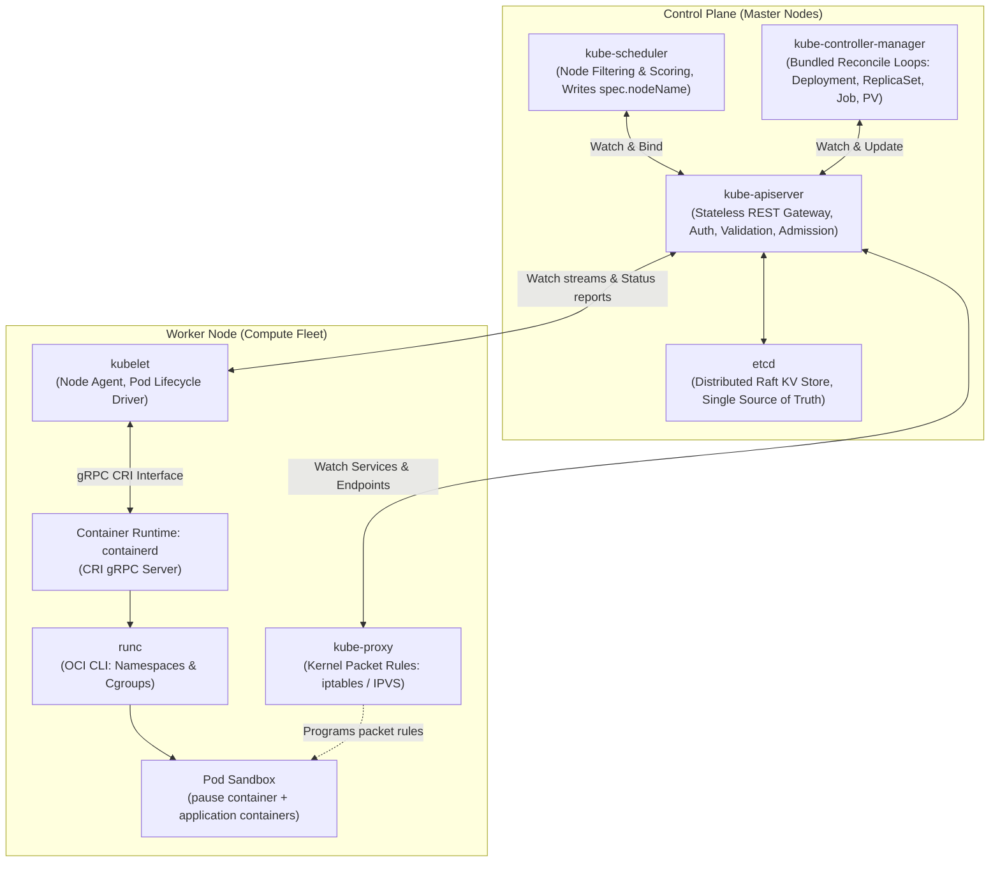
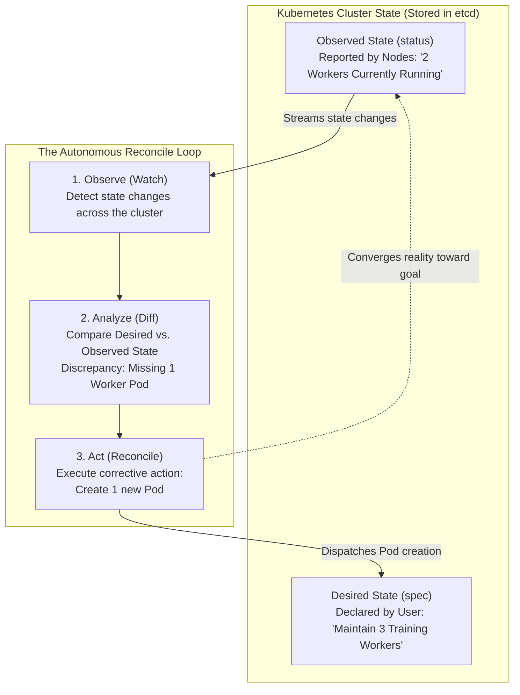
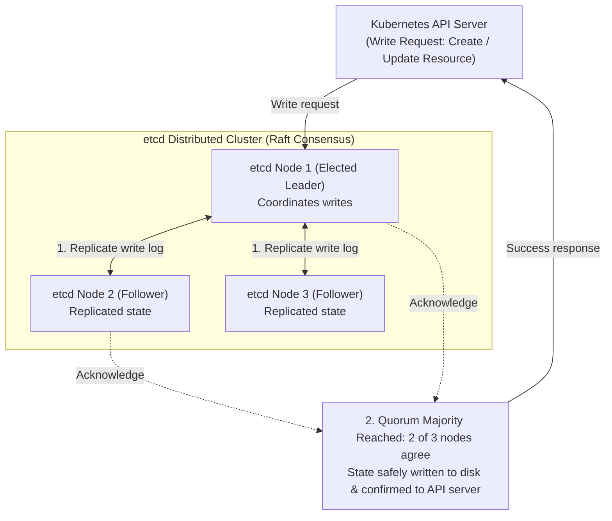
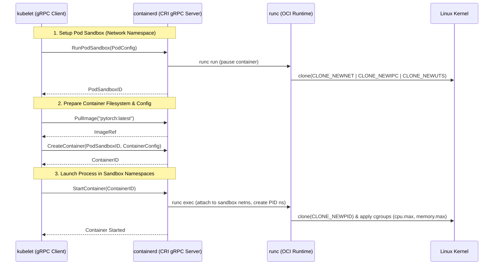
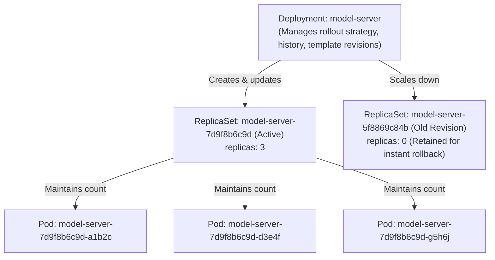
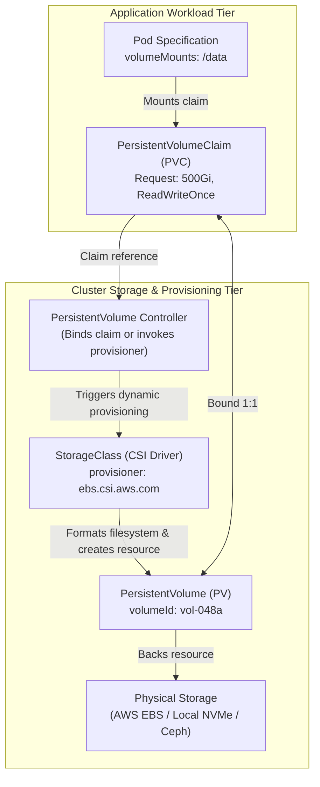
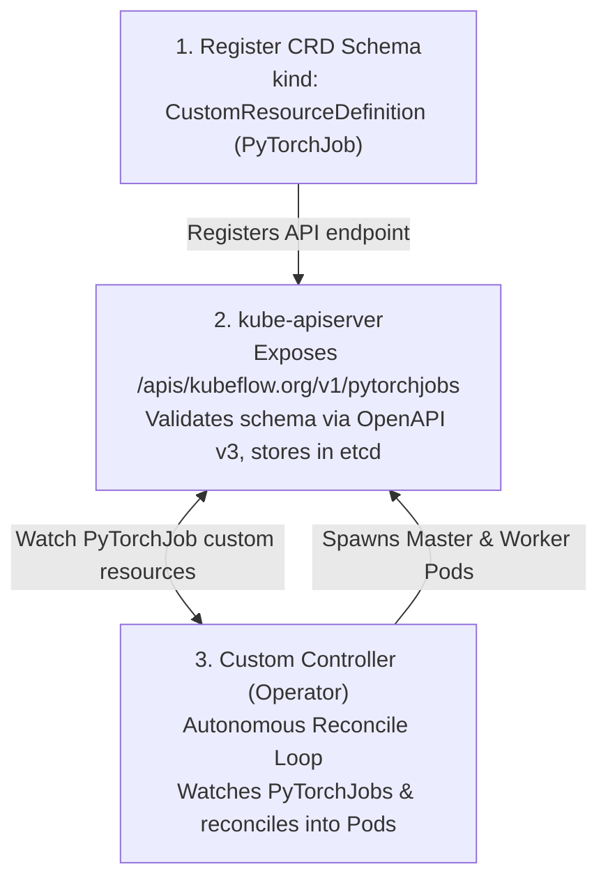

# Kubernetes Mechanics: Declarative Orchestration and Systems Architecture

Docker provides the execution primitive for modern machine learning: an immutable, isolated container running on a single operating system kernel. However, production machine learning workloads cannot survive on a single server. A production workload requires running dozens of parallel preprocessing workers, distributed multi-GPU training jobs, and resilient inference endpoints across a dynamic cluster of machines.

When an organization scales from one machine to a cluster of fifty machines, manual coordination collapses:
- How does the system determine which physical node has enough free CPU, RAM, and GPU memory to host a container?
- If a machine experiences a kernel panic or hardware failure at 2:00 AM, what detects the failure and reschedules interrupted training workloads on healthy hardware?
- How do distributed processes discover each other over the network when container IP addresses change dynamically?

**Kubernetes** is the distributed operating system designed to solve these coordination problems. It replaces manual server administration with **declarative state reconciliation**. 

To design, operate, and debug ML infrastructure on Kubernetes, one must understand its architectural components, the mechanics of its client-go reconciliation pipeline, its consensus storage engine, and how it manages storage and custom resources.

---

## Architectural Breakdown: Control Plane and Worker Nodes

A Kubernetes cluster is physically divided into two distinct planes: the **Control Plane** (the administrative brain) and the **Worker Nodes** (the compute fleet executing workloads).



### The Control Plane Components

The control plane maintains the global state of the cluster. In a production high-availability deployment, control plane components are replicated across 3 or 5 dedicated master nodes:

1. **`kube-apiserver`**:
   The central communication hub. It exposes a JSON/YAML over HTTP REST API. Every component in the cluster (the scheduler, the controllers, the worker node kubelets, and the `kubectl` CLI) communicates exclusively with the API server. No component ever talks directly to etcd or to peer components. The API server is completely stateless: it handles TLS termination, authentication, RBAC authorization, schema validation, and admission mutation/validation, before writing validated objects to etcd.
2. **`etcd`**:
   The cluster's database and single source of truth. It is a distributed, consistent, key-value store implementing the Raft consensus protocol. All Kubernetes object definitions (Pods, Services, Deployments, CRDs) are stored in etcd.
3. **`kube-scheduler`**:
   The placement engine. It continuously watches the API server for newly created Pods that lack an assigned node (`spec.nodeName == ""`). For each unassigned Pod, the scheduler evaluates all nodes in the cluster through a two-phase pipeline:
   - **Filtering (Predicates)**: Discards nodes that cannot accommodate the Pod (e.g., insufficient CPU/RAM, missing GPU resource, port conflicts, or unsatisfied `nodeSelector` / node affinity rules).
   - **Scoring (Priorities)**: Ranks surviving candidate nodes using weighted scoring algorithms (e.g., spreading Pods evenly across failure domains, or prioritizing nodes that already have the container image cached locally).
   - Once a winner is selected, the scheduler issues a `Binding` API call, which patches `spec.nodeName` on the Pod object.
4. **`kube-controller-manager`**:
   A single compiled binary hosting dozens of distinct reconciliation loops. Each controller inside the manager is responsible for reconciling one specific type of resource (e.g., ReplicaSet Controller, Deployment Controller, Job Controller, Node Lifecycle Controller, PersistentVolume Controller).

### The Worker Node Components

Worker nodes are physical servers or virtual machines where user workloads actually execute:

1. **`kubelet`**:
   The primary node agent running as a system daemon on every worker. It registers the node with the API server, continuously reports node health and resource capacity, and watches for Pods assigned to its specific hostname. It does not manipulate containers directly; instead, it delegates container creation, execution, and teardown to the container runtime via gRPC.
2. **`kube-proxy`**:
   The network routing coordinator. Running on each node, it watches Service and EndpointSlice objects via the API server. When a Service is created or backend Pod IPs change, `kube-proxy` programs local Linux kernel packet-filtering rules (`iptables` or `IPVS`) so that traffic directed to a virtual Service IP is automatically routed to a healthy target Pod.
3. **Container Runtime (`containerd`)**:
   The high-performance container supervisor. It receives instructions from the `kubelet` over a local Unix domain socket using the Container Runtime Interface (CRI), pulls OCI-compliant container images from registries, and invokes `runc` to spawn isolated processes.

---

## The Reconcile Loop Pattern: Declarative Convergence in Action

The central architectural pattern of Kubernetes is **declarative convergence**. 

In traditional imperative systems, infrastructure is managed through procedural commands: *"run this script, start this container, if it fails then restart it"*. If an imperative script crashes halfway through execution, the cluster is left in an unpredictable, half-configured state.

Kubernetes abandons imperative control in favor of a declarative model:
- **Desired State (`spec`)**: The user declares *what the cluster should look like* (e.g., "maintain 3 replicas of the model training worker"). You never specify *how* to achieve that state.
- **Observed State (`status`)**: The cluster continuously measures *what is actually happening in reality* (e.g., "currently 2 replicas are running on worker nodes").
- **The Controller**: An autonomous software loop that runs indefinitely, comparing observed state to desired state and executing corrective actions until reality converges with your goal.



### The Three Steps of Every Controller: Observe, Analyze, Act

Every Kubernetes controller (from the built-in ReplicaSet controller to custom workflow engines like the Argo `workflow-controller`) executes this identical three-step loop:

1. **Observe (Watch)**:
   The controller continuously watches for changes to its assigned resources. When a worker node crashes, a process terminates, or a user submits a new job, the controller receives a notification.
2. **Analyze (Diff)**:
   The controller fetches the resource's declared specification (`spec`) and compares it against its real-time condition (`status`). It calculates the mathematical difference (the **drift**) between what *should* exist and what *does* exist.
3. **Act (Reconcile)**:
   The controller executes the minimal set of API operations required to eliminate the drift:
   - If observed count is less than desired count -> create new Pods.
   - If observed count exceeds desired count -> terminate excess Pods.
   - If observed equals desired -> do nothing.

---

### Why the Reconcile Pattern Is Bulletproof

Two core architectural properties make this pattern uniquely resilient against distributed failures:

#### 1. Level-Triggered vs. Edge-Triggered Resilience

- **Edge-Triggered Systems (Fragile)**: React to individual event transitions (e.g., "Network dropped at 10:04 AM"). If an edge-triggered system is rebooting or experiences a network hiccup when an event fires, it misses the message. Its internal state remains permanently broken until manual intervention.
- **Level-Triggered Systems (Kubernetes Model)**: Evaluate the **entire current state** on every run. The reconcile loop does not care *how* a state was reached or which historical events happened in the past. It simply asks: *"What is the state right now, and what should it be?"*

If a controller crashes, stays offline for 30 minutes, and restarts, it does not need to replay a backlog of thousands of missed events. It simply inspects the current cluster state, computes the diff, and brings the cluster back into alignment within seconds.

#### 2. Idempotency

Every reconciliation operation is strictly **idempotent**: executing the reconcile loop once, twice, or fifty times in a row against an already converged system results in zero unintended side effects or duplicate resources.

---

### How Controllers Scale: In-Memory Caching and Workqueues

If hundreds of controllers constantly queried the central cluster database (`etcd`) to check status, the control plane would quickly saturate under massive read pressure. To prevent this, Kubernetes controllers use two scaling primitives:

1. **Local In-Memory Cache (Informers)**:
   Controllers do not query `etcd` during regular operations. Instead, they maintain a local, thread-safe in-memory cache of their watched resources. The API server streams real-time updates to keep this local cache synchronized. All read operations during reconciliation execute against local RAM in microseconds, protecting the central database from read amplification.
2. **Rate-Limiting Workqueues**:
   When changes occur, only the resource identifier (such as `default/xgboost-trainer`) is added to a workqueue.
   - **Deduplication**: If an unstable node triggers twenty rapid status updates in two seconds, the workqueue collapses them into a single task key. The controller reconciles the object once against its latest state, rather than executing twenty redundant runs.
   - **Exponential Backoff**: If a reconciliation fails (e.g., a cloud provider API is temporarily unreachable), the controller requeues the task with exponential delays, preventing failing tasks from overwhelming the cluster.

---

*(This declarative reconcile pattern shows up again later in the [Argo Workflows](../argo-workflows/why-argo.md) section, where it is extended to orchestrate multi-step ML pipelines as native Kubernetes DAGs).*

---

## etcd: Distributed Consensus and Cluster State

Every piece of state in a Kubernetes cluster resides in **etcd**. etcd is a distributed, consistent key-value store that acts as the single source of truth for the entire cluster.

Every Pod specification, node status, secret, configuration value, and custom workflow DAG is stored in etcd. If etcd is lost or corrupted, the cluster loses its brain.



### Raft Consensus and Quorum Mechanics

In a distributed environment, hosting the cluster database on a single server creates a single point of failure. If that server crashes, the entire cluster halts.

To ensure continuous availability, etcd runs as a distributed multi-node cluster (typically 3 or 5 members) governed by the **Raft consensus algorithm**:

1. **Leader Election**: The etcd members elect a single Leader. All client writes from the Kubernetes API server are sent exclusively to the leader.
2. **Log Replication**: When a write arrives, the leader appends the change to its log and replicates it to all follower members.
3. **Quorum Majority**: A write is committed only after a **strict majority (quorum)** of nodes confirm they have written the entry to disk:

`Quorum = floor(N / 2) + 1`

*(where `N` is the total number of members in the cluster)*.

| Cluster Size (`N`) | Quorum Needed | Tolerable Node Failures |
|---|---|---|
| 1 | 1 | 0 |
| 3 | 2 | **1** |
| 5 | 3 | **2** |
| 7 | 4 | **3** |

#### Why Production Clusters Use Odd Member Counts

An even number of nodes provides no extra fault tolerance and increases failure risk:
- A **3-node cluster** requires a quorum of 2. It tolerates **1** node failure.
- A **4-node cluster** requires a quorum of 3 (`floor(4/2) + 1 = 3`). If 2 nodes fail, the remaining 2 nodes cannot reach a quorum of 3, so the cluster freezes. Thus, a 4-node cluster still tolerates only **1** failure, while adding network overhead and a higher probability of split-brain.

Production Kubernetes clusters always deploy either **3 or 5 etcd members**.

---

### Why etcd Cannot Use Dynamic Kubernetes Storage

In Kubernetes, workloads request storage dynamically using PersistentVolumeClaims (PVCs) and cloud storage drivers (CSI plugins).

However, **etcd cannot run on a dynamic Kubernetes PersistentVolume**:
- Cloud CSI drivers and volume controllers run as Pods managed by Kubernetes.
- Those controllers cannot operate without the API server.
- The API server cannot function without etcd.

Hosting etcd on a dynamic volume creates a circular dependency deadlock: if the cluster reboots or the storage pod crashes, the storage system needs the control plane to recover, while the control plane needs the storage system to start.

**The Solution**: etcd must run directly against **fast, dedicated local host storage** (typically local NVMe SSDs). In production environments, etcd is deployed either directly as a host-level system service or as a **Static Pod** (a manifest placed directly on the host disk in `/etc/kubernetes/manifests/`, which the local `kubelet` launches directly without querying the API server).

---

## The Container Runtime Interface (CRI)

The `kubelet` is responsible for ensuring that containers declared in Pod manifests run on its node. However, the `kubelet` contains no native containerization code. It interacts with container engines via the **Container Runtime Interface (CRI)**.

CRI is a standardized **gRPC interface** exposed over a local Unix domain socket (e.g., `/run/containerd/containerd.sock`).



### The Core CRI gRPC Methods

When a Pod is scheduled to a node, the `kubelet` executes a structured sequence of gRPC remote procedure calls:

1. **`RunPodSandbox`**:
   Before launching any application container, the runtime must establish the environment that all containers in the Pod share. The runtime launches a lightweight **`pause` container**. The `pause` container's sole purpose is to hold open the shared Linux namespaces:
   - Network namespace (`CLONE_NEWNET`): Assigns the Pod's IP address and localhost loopback interface.
   - IPC namespace (`CLONE_NEWIPC`): Enables shared memory communication between containers in the same Pod.
2. **`PullImage`**:
   The runtime communicates with the remote image registry using OCI distribution protocols, downloads the image layers, and verifies content hashes.
3. **`CreateContainer`**:
   Configures the container within the existing Pod sandbox. The runtime unpacks the image layers into an OverlayFS mount, maps host volume mounts into the container root, and translates Kubernetes resource specifications (`resources.limits`) into cgroup v2 controller files (`cpu.max`, `memory.max`).
4. **`StartContainer`**:
   Calls `runc` to execute the entrypoint process inside the configured namespaces and cgroups.
5. **`ContainerStatus` and `ListContainers`**:
   Polled periodically by `kubelet` to monitor container health and report phase transitions back to the API server.

---

## Deployment -> ReplicaSet -> Pod Cascade

In Kubernetes, users rarely manage individual Pods directly. Bare Pods are ephemeral: if a bare Pod crashes or its host node suffers a hardware failure, the Pod is gone permanently. 

To provide automated self-healing and zero-downtime updates, Kubernetes organizes workloads into a three-tier hierarchy: **Deployment -> ReplicaSet -> Pod**.



### Why the Deployment Controller Never Creates Pods Directly

A fundamental architectural principle of Kubernetes is **separation of concerns across distinct controllers**:

- **The Deployment Controller**: Its sole responsibility is managing **revisions and rollout state transitions**. It updates desired replica counts across different ReplicaSets according to rollout strategies (`RollingUpdate` or `Recreate`). It has no logic for creating or deleting Pods.
- **The ReplicaSet Controller**: Its sole responsibility is maintaining a fixed **population of Pods**. It continuously compares the count of healthy Pods matching its label selector against its `.spec.replicas`. If count < replicas, it creates Pods; if count > replicas, it deletes Pods.
- **The Scheduler**: Assigns unplaced Pods to nodes.
- **The Kubelet**: Launches containers for Pods assigned to its node.

Each controller does one job, watching the layer directly beneath it.

### The Template-Hash Suffix: Disambiguation and Instant Rollbacks

When a Deployment is created, the ReplicaSet's name is appended with a deterministic 10-character hash (e.g., `model-server-7d9f8b6c9d`):

1. **Selector Disambiguation During Rolling Updates**:
   During a rolling update, two different versions of an application exist simultaneously. Both versions share the common application label (e.g., `app: model-server`).
   If the ReplicaSets only selected by `app: model-server`, both the old ReplicaSet controller and the new ReplicaSet controller would claim ownership of all Pods, triggering an infinite race condition where both controllers delete and recreate each other's Pods.
   To prevent this, the Deployment controller hashes the entire `.spec.template` object and automatically injects a `pod-template-hash` label into both the ReplicaSet's selector and the Pod's labels. Each ReplicaSet strictly selects only Pods carrying its exact template hash.
2. **Deterministic Identity for Instant Rollbacks**:
   The hash is purely a function of the Pod template specification. If an engineer accidentally rolls out a broken image and executes `kubectl rollout undo deployment/model-server`:
   - The Deployment controller hashes the previous template.
   - It discovers that the old ReplicaSet (`model-server-5f8869c84b`) already exists in etcd (retained via `revisionHistoryLimit`, which defaults to 10).
   - Rather than creating a new object or rebuilding anything, it simply sets `replicas: 3` on the old ReplicaSet and `replicas: 0` on the broken one. Rollback completes in milliseconds.

---

## Storage Indirection: Pod -> PVC -> PV -> StorageClass

In cloud and cluster computing, compute nodes are disposable, but machine learning data (raw datasets, checkpoints, feature stores) must persist. Kubernetes decouples storage consumption from storage implementation through a three-stage indirection chain:



1. **PersistentVolumeClaim (PVC)**:
   The user-facing storage request. An ML practitioner declares: "My training job needs 500 GB of storage with `ReadWriteOnce` access." The user does not specify whether that storage is an AWS EBS volume, a Google Cloud Persistent Disk, or a local Ceph pool. This keeps pipeline manifests completely portable across clouds and on-premise clusters.
2. **PersistentVolume (PV)**:
   The cluster-level representation of actual physical storage. It defines the concrete backend storage parameters (e.g., volume ID, disk UUID, NFS server IP).
3. **StorageClass and CSI Provisioners**:
   Enables **dynamic provisioning**. When a PVC references a `StorageClass`, the PersistentVolume controller does not wait for an administrator to manually format a disk. Instead, it invokes the CSI driver plugin, which calls cloud or storage APIs to create the physical volume, formats it with a filesystem (ext4/xfs), and automatically creates a corresponding PV object.
4. **Binding**:
   The PV controller binds the PVC to the PV in a strict 1:1 relationship. The Pod mounts the PVC, and the `kubelet` attaches the underlying physical device to the host before bind-mounting it into the container.

---

## Custom Resource Definitions (CRDs) and the Operator Pattern

Out of the box, Kubernetes understands generic primitives: Pods, Deployments, Services, and Jobs. However, complex machine learning systems require higher-level abstractions:
- Argo Workflows defines a **`Workflow`** representing a multi-step pipeline DAG.
- Kubeflow defines a **`PyTorchJob`** representing a multi-node distributed training run.

Kubernetes allows engineers to extend its API using **Custom Resource Definitions (CRDs)**.



### Why a CRD Is Inert Without a Custom Controller

Registering a CRD with the API server is straightforward:

```yaml
apiVersion: apiextensions.k8s.io/v1
kind: CustomResourceDefinition
metadata:
  name: pytorchjobs.kubeflow.org
spec:
  group: kubeflow.org
  versions:
    - name: v1
      served: true
      storage: true
      schema:
        openAPIV3Schema:
          type: object
          properties:
            spec:
              type: object
              ...
  names:
    kind: PyTorchJob
    plural: pytorchjobs
```

When you apply this YAML, the API server dynamically generates new HTTP endpoints (`/apis/kubeflow.org/v1/pytorchjobs`) and enables full `kubectl` validation, RBAC, and storage in etcd.

However, **a CRD on its own does absolutely nothing**. 

A CRD is purely a database table schema. If you submit a `PyTorchJob` custom resource when only the CRD is installed, the API server serializes the YAML and commits it into etcd. It will sit in etcd permanently, inert, with zero compute allocated.

To make a CRD functional, you must deploy an **Operator (Custom Controller)**:
- The operator is an ordinary Go program running inside a standard Kubernetes Deployment.
- It runs the exact same reconcile loop pattern (Observe -> Analyze -> Act) as built-in controllers.
- When it detects a newly created `PyTorchJob` key, its reconcile logic parses the specification, resolves multi-node ranks, generates master and worker Pod specifications, and issues `Create` API calls to spin up real pods.

This union of a Custom Resource Definition and a custom reconciliation loop is called the **Operator Pattern**.

---

## Resource Management and Autoscaling Comparison

Managing resources in an ML cluster is fundamentally different from managing standard stateless web applications. The following comparison highlights the roles of different resource management and autoscaling mechanisms in Kubernetes:

| Mechanism | Operating Scope | Trigger / Driving Metric | Action Executed | Machine Learning Behavior & Limitations |
|---|---|---|---|---|
| **ResourceQuota** | K8s Namespace | Immediate (admission phase) | Hard rejection (`403 Forbidden`) when requested CPU/RAM/GPU exceeds quota | **Zero Queueing**: Rejects jobs outright if the team exceeds limits. Cannot queue a training job to run when existing jobs finish. |
| **Kueue** | Cluster / Batch Queues | Workload submission against custom queue | Intercepts batch Jobs; suspends them in a queue until cluster capacity frees up | **Essential for ML Batch**: Implements FIFO/Fair-share job admission, preventing cluster resource exhaustion. |
| **Horizontal Pod Autoscaler (HPA)** | Deployment / ReplicaSet | Periodic polling (every 15s) of CPU/memory or custom metrics | Scales replica count up or down: `targetReplicas = ceil(currentReplicas * (currentMetric / targetMetric))` | **Unsuitable for Batch ML**: Designed for independent stateless web servers absorbing continuous HTTP request traffic. Cannot scale or coordinate distributed training workers. |
| **Cluster Autoscaler** | Infrastructure Nodes | Node scheduling failure (`Pod sits in Pending` with `0/N nodes available`) | Simulates node additions and calls cloud APIs (AWS/GCP/Azure) to spin up new VM instances | **Slow Cloud Scaling**: Adding a GPU node takes 3 to 8 minutes. Scaledown occurs only after nodes sit unutilized for a cooldown period. |
| **Kubeflow Training Operator** | Custom Resource (`PyTorchJob`, `TFJob`) | Declarative spec creation (`replicas: Master=1, Worker=N`) | Creates role-differentiated Pods, injects distributed environment variables, creates headless DNS services | **Group Failure Semantics**: Treats multi-pod training as an atomic unit. If worker 0 fails, it terminates the entire group to avoid deadlocks. |

---

## What Raw Kubernetes Jobs Cannot Do for ML Pipelines

Kubernetes provides a built-in object designed for run-to-completion batch workloads: the **Job**. A Job launches a Pod, monitors it to completion, and optionally retries on failure up to `spec.backoffLimit`.

However, an enterprise machine learning workflow is not a single isolated batch task. It is a multi-step, interconnected pipeline:

```text
[ Data Ingestion ] 
        |
        v
[ Feature Engineering (High CPU) ] 
        |
        v
[ Distributed Training (Multi-GPU) ] 
        |
        v
[ Model Validation & Evaluation ] 
        |
        v
[ Human Approval Gate (Review Metrics) ] 
        |
        v
[ Model Registry & Deployment ]
```

When engineering teams attempt to build this pipeline using raw Kubernetes Jobs alone, they encounter critical missing capabilities:

1. **No Pipeline Dependency Graph (DAG Execution)**:
   Raw Kubernetes Jobs are completely independent objects. Job B has no mechanism to declare: "Wait for Job A to complete successfully before starting." To chain Jobs together, an engineer must write an external orchestration script that continuously polls the API server, inspects Job status fields, and submits the next manifest.
2. **Absence of Native Artifact and Data Passing**:
   Raw Jobs have no built-in data handoff mechanism. If the preprocessing Job outputs a Parquet dataset, and the training Job requires that dataset as input, Kubernetes provides no native protocol to pass that file across network boundaries. Engineers are forced to hand-craft custom upload and download logic inside every individual container script.
3. **Coarse Failure Handling**:
   A raw Job's `backoffLimit` retries the entire container from scratch. It cannot distinguish between a transient infrastructure fault (e.g., node disk pressure) and a permanent code defect (e.g., a syntax error in Python). Furthermore, if Step 4 of a 5-step pipeline fails, raw Kubernetes cannot retry only the failed step; the entire pipeline must be manually re-triggered from the beginning.
4. **No Native Human-in-the-Loop Approval Gates**:
   Raw Kubernetes Jobs run continuously to completion or failure. There is no primitive to pause execution (`suspend`), present model evaluation metrics to an ML engineer, and resume execution only after explicit human sign-off.
5. **No Unified Pipeline Execution History**:
   While etcd stores active Jobs, completed Jobs are eventually pruned by garbage collection. Kubernetes provides no permanent, queryable audit database storing the end-to-end lineage of a pipeline run: which code commit, dataset version, hyperparameters, and artifacts were used together.

Attempting to solve these challenges with custom shell scripts or ad-hoc Python wrappers results in reinventing a brittle, homegrown orchestrator.

This operational void is precisely what **Argo Workflows** addresses. Argo Workflows extends Kubernetes via CRDs to provide native DAG orchestration, automated artifact passing, per-step retry policies, human-in-the-loop pauses, and persistent pipeline history directly on top of the Kubernetes control plane.

*(This operational transition is explored in detail in the next section: [Argo Workflows](../argo-workflows/why-argo.md)).*

---

### Official Documentation & Further Reading

- [Kubernetes Documentation: Cluster Architecture](https://kubernetes.io/docs/concepts/architecture/)
- [Kubernetes Documentation: Custom Resources and Operators](https://kubernetes.io/docs/concepts/extend-kubernetes/api-extension/custom-resources/)
- [Kubernetes Documentation: Jobs and Batch Workloads](https://kubernetes.io/docs/concepts/workloads/controllers/job/)
- [etcd Documentation: Raft Consensus and Operating Clusters](https://etcd.io/docs/v3.5/)
- [Container Runtime Interface (CRI) Specification](https://kubernetes.io/docs/concepts/architecture/cri/)
- [Kueue: Kubernetes-Native Job Queueing](https://kueue.sigs.k8s.io/)
