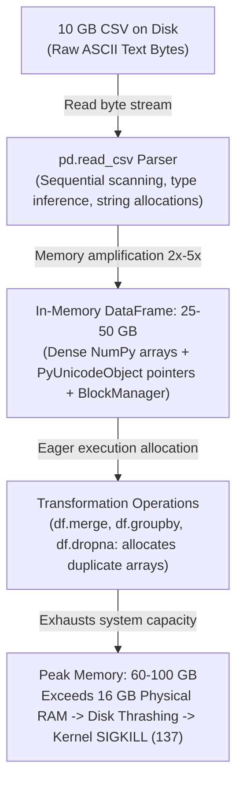
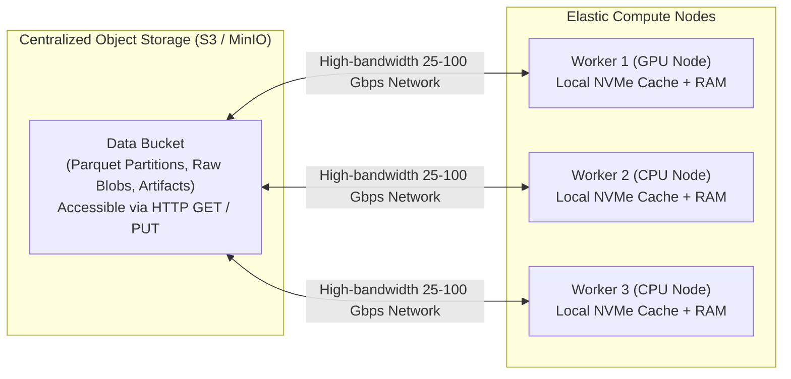

# Why Distributed Computing: Overcoming the Single-Machine Memory Wall

Every machine learning practitioner eventually encounters the memory wall. The script begins simply: an engineer opens a Jupyter notebook or executes a Python script on a 16 GB developer workstation to train a model on a 10 GB CSV file containing a high-volume user interaction dataset.

```python
import pandas as pd

# Load 10 GB feature dataset
df = pd.read_csv("user_events.csv")
```

The fans spin up to maximum speed. The operating system UI freezes, the mouse cursor stutters, and the terminal halts with no output. Moments later, the shell abruptly terminates the process:

```text
zsh: killed     python train.py
[Exit code 137]
```

Exit code 137 indicates that the process received `SIGKILL` (signal 9: 128 + 9 = 137) from the operating system kernel's Out-Of-Memory (OOM) Killer.

At first glance, this crash appears counterintuitive. The dataset is 10 GB on disk, and the workstation has 16 GB of physical RAM. Intuitively, the dataset should fit with 6 GB of memory to spare. However, in data systems, disk representations and in-memory execution structures operate under fundamentally different physical constraints. 

To build robust machine learning infrastructure, one must understand the exact mechanical reasons why single-machine pipelines fail at scale, why in-memory data structures amplify size 2x to 5x, and how modern distributed architectures solve these bottlenecks.

---

## The Physical Inefficiency of CSV on Disk

A Comma-Separated Values (CSV) file is a legacy transport format designed for human readability, not computational efficiency. At the physical disk and I/O layer, CSV introduces severe performance degradation across three mechanical dimensions:

1. **Plain Text (ASCII/UTF-8) Encoding Overhead**:
    In a CSV file, every digit, character, and delimiter is encoded as a discrete character byte.
    - **Integers**: A 64-bit integer (`int64`) in binary requires exactly 8 bytes of storage, regardless of value, and can represent numbers up to 9 quintillion. In CSV format, the integer `1234567890` is written as 10 separate ASCII characters, consuming 10 bytes on disk (a 25% penalty). Larger integers incur even higher storage penalties.
    - **Floating Point Numbers**: An IEEE 754 double-precision float (`float64`) in binary requires exactly 8 bytes. In a CSV file, a value such as `3.141592653589793` is written as 17 ASCII bytes (a 112% penalty).
2. **Absence of Embedded Schema and Metadata**:
    A CSV file contains no type headers, no column indices, and no block metadata. When `pd.read_csv()` executes, the parser cannot know whether column 15 is an integer, float, timestamp, or categorical string. The C-parser underlying Pandas must read the raw byte stream sequentially, split on delimiters, parse strings, and infer types row by row. If a single string appears at row 1,000,000 in an otherwise integer column, the entire column buffer must be retroactively cast and reallocated.
3. **Delimiter and Escaping Overhead**:
    Commas, quotation marks, newline characters (`\n` or `\r\n`), and escape characters consume disk bandwidth and storage space without contributing information to the model.

!!! note "Under the Hood: Why CSVs Bloat on Disk and in Transit"
    CSVs represent numbers as character sequences rather than packed binary words. A single row containing ten `float64` features requires 80 bytes in binary format. In CSV text representation, with 17 digits per float plus commas and a newline, that same row requires approximately 180 bytes. Transporting and parsing a 10 GB CSV requires transferring 10 billion text bytes over the disk bus, scanning every single byte sequentially for delimiter boundaries, and executing millions of CPU-intensive string-to-binary conversions (`strtod` and `strtoll`).

---

## Memory Amplification: How 10 GB Becomes 50 GB in RAM

When `pd.read_csv()` loads data into a Pandas DataFrame, physical memory consumption does not match on-disk size. It typically expands by a factor of **2x to 5x**. 

This expansion is driven by the interaction between the CPython runtime, Python's object model, and NumPy array layouts.



### 1. Python Object Overhead: The String Problem

In numerical computing, columns containing pure integers or floats are parsed directly into contiguous C-style NumPy arrays (`int64` or `float64`). An array of 10 million `float64` values occupies a single, dense 80 MB block of RAM. This is compact and cache-efficient.

The catastrophic memory expansion in Pandas originates in **string and object columns**.

In standard Python (CPython), everything is an object, and every object is represented by a C struct. A standard Python string is not an array of characters; it is a `PyUnicodeObject`. In a 64-bit CPython runtime, the `PyUnicodeObject` struct carries substantial metadata before any string content is stored:

- `ob_refcnt` (reference count for garbage collection): 8 bytes
- `ob_type` (pointer to the type object `&PyUnicode_Type`): 8 bytes
- `length` (number of characters): 8 bytes
- `hash` (cached string hash code): 8 bytes
- `state` (bitfields for interned status, character size kind, ASCII flag): 8 bytes
- `wstr` / buffer pointers: 8 to 16 bytes

A Python string object requires **48 to 56 bytes of struct metadata** before storing a single character.

Furthermore, a NumPy array of type `object` cannot store variable-length Python objects inline. Instead, it allocates a contiguous array of **8-byte 64-bit memory addresses (pointers)**. Each pointer refers to an independent `PyUnicodeObject` allocated elsewhere on the process heap.

```text
NumPy Object Column Buffer (in RAM)
[ Pointer 0 ] ---> PyUnicodeObject Struct (48 bytes) + 'active\0' (7 bytes) + padding (~65 bytes total)
[ Pointer 1 ] ---> PyUnicodeObject Struct (48 bytes) + 'active\0' (7 bytes) + padding (~65 bytes total)
[ Pointer 2 ] ---> PyUnicodeObject Struct (48 bytes) + 'pending\0' (8 bytes) + padding (~66 bytes total)
...
[ Pointer N ] ---> PyUnicodeObject Struct (48 bytes) + 'failed\0' (7 bytes) + padding (~65 bytes total)
```

Consider the concrete math for a categorical column containing the 6-byte string `'female'`:

- **On disk in CSV**: 6 ASCII bytes (plus a comma delimiter = 7 bytes).
- **In Pandas memory**:
  - 8-byte pointer in the NumPy pointer array.
  - 50+ bytes for the `PyUnicodeObject` struct header.
  - 6 bytes of UTF-8 character bytes + 1 null terminator byte.
  - Memory allocator alignment padding (typically rounded to an 8-byte boundary).
  - **Total in RAM**: Approximately **65 to 72 bytes per entry**.

A single string that took 6 bytes on disk expands to over 65 bytes in memory, an inflation factor exceeding **10x** for that column. When a dataset contains millions of rows across dozens of text or categorical columns, a 10 GB CSV file easily balloons to 25 GB or 50 GB of resting RAM.

### 2. The Pandas BlockManager and Intermediate Copies

Pandas does not manage columns independently. Historically, Pandas organizes columns using an internal engine called the `BlockManager`.

The `BlockManager` groups columns of identical physical data types together into shared 2D NumPy arrays:
- All `float64` columns are concatenated into a single 2D float array.
- All `int64` columns are concatenated into a single 2D integer array.
- All `object` columns are concatenated into a 2D pointer array.

During the execution of `pd.read_csv()`, the parser processes the file in chunks. As it reads, it constructs individual 1D column arrays, subsequently merging and consolidating them into the 2D blocks required by the `BlockManager`. This consolidation requires allocating new temporary buffers and copying data across blocks. 

During the read phase alone, memory consumption spikes far higher than the final resting size of the DataFrame.

---

## Eager Execution: Why Transformations Multiply Memory

Loading the data into memory is only the initial stage of a machine learning pipeline. Once loaded, the data must be cleaned, filtered, joined, and transformed.

In Pandas, operations execute **eagerly**. Eager execution means that every function call evaluates immediately and generates a brand-new in-memory data structure rather than modifying memory in place.

Consider common feature engineering operations:

```python
# 1. Drop missing records: allocates a brand new DataFrame
df_clean = df.dropna()

# 2. Filter rows: evaluates a boolean mask array, then allocates a filtered copy
df_filtered = df_clean[df_clean["metric_value"] > 0]

# 3. Feature transformation: allocates a new array
df_filtered["log_metric"] = np.log1p(df_filtered["metric_value"])

# 4. Join with user metadata: builds hash tables and allocates merged buffers
final_df = df_filtered.merge(user_metadata, on="user_id")
```

Every single step in this sequence allocates fresh memory buffers:
- **Filtering (`df[df['col'] > 0]`)**: Evaluates a boolean mask (1 byte per row) and subsequently allocates a completely new DataFrame containing copies of the matching rows.
- **Joins and Merges (`df.merge()`)**: Builds an in-memory hash index of the join keys on both tables, evaluates join indices, and allocates memory for the combined schema.
- **Feature Math**: Creating interaction terms or scaling columns allocates new column buffers before discarding intermediate calculations.

### Resting Memory vs. Peak Memory

There is a critical distinction between:
- **Resting Memory**: The RAM occupied by a DataFrame sitting idle in the Python namespace (e.g., 30 GB for an expanded 10 GB CSV).
- **Peak Memory**: The maximum instantaneous RAM consumed during an active computation (e.g., a merge, sort, or groupby operation).

During a merge or group aggregation on a 30 GB DataFrame, Pandas requires memory for:
1. The original source DataFrame.
2. The secondary lookup table.
3. Hash tables and index join maps.
4. The output destination DataFrame.

Under these conditions, peak RAM consumption reaches **60 GB to 100 GB**.

```text
Physical Memory Lifecycle (Single Node)
Memory
  ^
  |                                        [PEAK RAM: 75 GB]
  |                                     /--------------------\
  |                                    /  (Merge / Groupby)   \
  |          [RESTING RAM: 35 GB]     /                        \
  |         /------------------------/                          \
  |        /   (DataFrame Loaded)                                \
  |       /                                                       \
  |      /                                                         \
  +-----+-----------------------------------------------------------+----> Time
       10 GB CSV               Physical Hardware Limit: 16 GB RAM
       on Disk                 --> System swaps to SSD -> OOM Kill
```

### The Operating System Reaction: Thrashing and the OOM Killer

When process memory allocation exceeds the 16 GB of physical RAM installed on the machine, the operating system kernel must intervene:

1. **Virtual Memory Paging and Swap Thrashing**:
   The Linux virtual memory manager attempts to alleviate memory pressure by evicting pages from RAM to the configured swap space on the SSD or NVMe drive.
   - Accessing data in DDR4/DDR5 RAM requires approximately **100 nanoseconds**.
   - Accessing data paged out to an NVMe SSD requires approximately **10 to 100 microseconds**.
   Swapping introduces a **1,000x to 100,000x latency penalty**. The CPU cores spend 99% of their clock cycles stalled, waiting on I/O page faults (`iowait`). The entire operating system locks up.
2. **The Out-Of-Memory (OOM) Killer**:
   Once physical RAM and swap space are completely exhausted, any further memory allocation request (`brk` or `mmap` syscall) fails. Because the kernel cannot satisfy allocations, it invokes the OOM Killer routine.
   The OOM Killer calculates an `oom_score` for every running process based on the proportion of system memory it consumes. The Python data processing process, consuming over 90% of system RAM, receives the highest score. The kernel immediately sends an uncatchable `SIGKILL` (signal 9) to the process. The process terminates instantly, and all intermediate computation is lost.

---

## The Distributed Systems Architecture

Operating at terabyte scale requires a multi-layer systems architecture. Scaling is not achieved by altering a single library or upgrading one machine, but by deploying a stack where each layer handles a specific physical constraint of data movement, memory allocation, execution isolation, or cluster scheduling.

Every component in this architecture is necessary. The table below outlines how each layer addresses a distinct failure mode of the single-machine model, followed by in-depth examinations of what each layer does under the hood:

| Systems Layer | The Single-Machine Bottleneck | The Architectural Solution | Key Technologies |
| :--- | :--- | :--- | :--- |
| **1. Compute Engine** | Eager execution loads the entire dataset into one process; intermediate transforms allocate duplicate buffers until RAM is exhausted. | **Out-of-core partitioning & lazy DAG execution**: query plans are optimized as a whole; data is processed in partitioned streams. | Apache Spark, Polars, Dask |
| **2. Data Formats** | CSV plain text bloats on disk; string columns expand over 10x in RAM due to CPython `PyObject` headers and pointer arrays. | **Columnar binary formats**: Parquet provides column pruning and compression at rest; Arrow provides zero-copy in-memory buffers. | Apache Parquet, Apache Arrow |
| **3. Storage Architecture** | Binding datasets to local worker disks causes capacity limits, idle hardware, and prevents multi-node access. | **Decoupled object storage**: centralizes state into high-throughput blob storage accessed via HTTP range requests. | MinIO, AWS S3 |
| **4. Runtime Environment** | Dependency drift, mismatched system libraries, and uncoordinated environments between dev laptops and cluster nodes. | **Immutable container images**: packages identical code, system libraries, and runtime dependencies across all worker nodes. | Docker, OCI Containers |
| **5. Cluster Orchestration** | A single machine has a hard hardware ceiling; manual multi-node scheduling lacks failure recovery and job queuing. | **Automated cluster scheduling & DAG orchestration**: schedules containers across nodes, manages retries, and coordinates pipeline dependencies. | Kubernetes, Argo Workflows |

---

### 1. Out-of-Core and Distributed Processing (Compute Engine)

To process datasets larger than memory, data must be broken down into manageable pieces and processed lazily rather than eagerly.

#### Chunks vs. Partitions

There is a fundamental difference between chunking on a single machine and partitioning in a distributed system:

| Architectural Property | Chunk (`pd.read_csv(chunksize=N)`) | Partition (Dask, Spark, Distributed Engines) |
|---|---|---|
| **Processing Paradigm** | Single process, single machine | Distributed across cluster worker processes |
| **Execution Flow** | Sequential iteration in a Python `for` loop | Parallel concurrent tasks scheduled across nodes |
| **Identity and State** | Ephemeral, disposable row slices | Persistent, addressable subdivision (often its own file) |
| **Fault Tolerance** | None: a failure on chunk 99 crashes the entire script | High: a failed partition is rescheduled and retried independently |
| **Parallelism** | Bound to 1 CPU core unless manually multithreaded | Native horizontal scale across hundreds of CPU/GPU cores |

#### Eager vs. Lazy DAG Execution

Traditional Pandas code executes eagerly with zero knowledge of upcoming instructions. Modern engines (Polars, Dask, Apache Spark) execute **lazily**:

1. When an engineer specifies transformations (`filter`, `select`, `join`), the engine does not touch the data.
2. Instead, it constructs a **Directed Acyclic Graph (DAG)** representing the execution plan.
3. The query optimizer inspects the entire DAG before executing a single byte:
   - **Predicate Pushdown**: If the pipeline filters by `country == 'US'`, the optimizer pushes this condition directly into the storage reader, reading only matching row groups and skipping irrelevant data.
   - **Projection Pruning (Column Pruning)**: If a table has 200 columns but the model only trains on 5, the remaining 195 columns are never read from disk or transferred across the network.
   - **Operation Fusion**: Adjacent mapping steps are fused into a single processing pass over the data, eliminating intermediate memory allocations.
4. Execution only commences when an explicit action or sink is invoked (such as `.collect()`, `.compute()`, or `.sink_parquet()`).

#### Processing Engines: Dask vs. Polars vs. Spark

Depending on the operational scale, different processing engines are selected:

- **Polars**: Written in Rust, built natively on the Apache Arrow memory specification. Polars is primarily an ultra-fast, multi-threaded engine optimized for single-machine efficiency. Its query optimizer and vectorized execution can process tens of millions of rows in seconds on a standard workstation, but its primary target is a single node.
- **Dask**: Written in pure Python. A Dask DataFrame coordinates many individual Pandas DataFrames organized into partitions. A central scheduler assigns partition tasks to local threads or distributed worker nodes. Dask provides an API nearly identical to Pandas, making it ideal for teams with existing Python codebases who need to scale out to a cluster.
- **Apache Spark**: The industry standard for multi-terabyte and petabyte distributed processing. Spark is written in Scala and runs on the **Java Virtual Machine (JVM)**. 
  - PySpark provides a Python API, but Python does not execute the heavy computation. Instead, the PySpark client communicates via sockets and Py4J with a JVM **Driver** process.
  - The Driver breaks the DAG into stages and tasks, scheduling them across distributed JVM **Executors** running on cluster nodes.
  - The JVM acts as a process virtual machine: an isolated bytecode runtime running as an ordinary Linux OS process (not a hardware-virtualizing hypervisor like VirtualBox).

---

### 2. Columnar Data Formats: Parquet and Arrow (Data Layer)

Modern infrastructure replaces CSV with two complementary columnar technologies: **Apache Parquet** for storage on disk, and **Apache Arrow** for data in memory.

#### Apache Parquet: Efficient at Rest (Disk)

Parquet is an open-source, columnar, binary storage format designed specifically for analytical and machine learning workloads. Unlike CSV, which stores data row-by-row as ASCII text, Parquet organizes data hierarchically:

```text
Parquet File Physical Structure
+--------------------------------------------------------------------+
| Header: MAGIC ('PAR1')                                             |
+--------------------------------------------------------------------+
| Row Group 0 (e.g. 500,000 rows)                                    |
|  +---------------------------------------------------------------+ |
|  | Column Chunk 0 ('user_id'): Pages 0..N [RLE / Bit-Packed]     | |
|  +---------------------------------------------------------------+ |
|  | Column Chunk 1 ('amount'):  Pages 0..N [Snappy Compressed]    | |
|  +---------------------------------------------------------------+ |
|  | Column Chunk 2 ('category'): Pages 0..N [Dictionary Encoded]   | |
|  +---------------------------------------------------------------+ |
+--------------------------------------------------------------------+
| Row Group 1 (e.g. 500,000 rows)                                    |
|  ...                                                               |
+--------------------------------------------------------------------+
| File Footer (Metadata):                                            |
|  - Schema definition (column names, physical types, logical types) |
|  - Row Group Metadata:                                             |
|      - Column 0: Min=1, Max=500000, NullCount=0                    |
|      - Column 1: Min=0.50, Max=9950.00, NullCount=12               |
|      - Column 2: Dictionary offsets, Page boundaries               |
+--------------------------------------------------------------------+
| Footer Length (4 bytes) + MAGIC ('PAR1')                           |
+--------------------------------------------------------------------+
```

1. **Hierarchical Layout**:
   - **File**: Contains data and metadata.
   - **Row Groups**: Horizontal logical partitions of rows (typically 128 MB to 512 MB each).
   - **Column Chunks**: Vertical partitions within each row group containing data for a single column.
   - **Pages**: Sub-chunks within a column chunk (typically 1 MB), representing the atomic unit for compression and encoding.
2. **The File Footer and Predicate Pushdown**:
   A Parquet file stores its metadata in a **Footer** at the very end of the file. The footer contains the complete table schema and per-row-group statistics (minimum value, maximum value, null counts).
   - When a query engine requests rows where `metric_value > 10000.0`, it reads only the small footer first.
   - If Row Group 0 has `Max=9950.00`, the engine skips Row Group 0 entirely without reading its bytes off disk or over the network.
3. **Columnar Encodings**:
   Because columns store values of identical types contiguously, Parquet applies advanced encodings before compression:
   - **Dictionary Encoding**: Repeated strings (e.g., `'pending'`, `'completed'`) are replaced with compact 1-byte or 2-byte integer IDs, accompanied by a small lookup dictionary.
   - **Run-Length Encoding (RLE) and Bit-Packing**: Repeated sequences of integers are stored as a count and a value. Small integers are packed into minimal bit widths (e.g., storing numbers between 0 and 3 in 2 bits instead of 64 bits).
   - **Delta Encoding**: Monotonically increasing numbers (like auto-incrementing IDs or millisecond timestamps) are stored as small differences (deltas) between consecutive values.
4. **Compression Codecs**:
   After encoding, pages are compressed using high-speed block compression codecs:
   - **Snappy**: Optimized for extreme decompression speeds with moderate compression ratios.
   - **Zstandard (Zstd)**: Modern standard offering superior compression ratios while maintaining fast decompression performance.

#### Apache Arrow: Efficient in Motion (RAM)

While Parquet optimizes data on disk, **Apache Arrow** standardizes data layout in memory.

Historically, passing data between different tools (e.g., reading data in C++, passing it to Python, and running inference in Rust) required serializing the data into a buffer, copying it across process boundaries, and deserializing it into the recipient's internal format. Serialization accounts for up to 80% of CPU time in data pipelines.

Apache Arrow defines a standardized, language-independent columnar memory format:
- Arrays are represented as contiguous, byte-aligned C memory buffers.
- Missing values are tracked via contiguous validity bitmasks.
- **Zero-Copy Data Sharing**: Different libraries running on the same host (e.g., DuckDB, Polars, PyArrow, PyTorch) can map and read the exact same physical memory buffer without serialization, translation, or copying.

> **Rule of thumb**: Parquet is the standard for data at rest (efficient storage on disk); Arrow is the standard for data in motion (efficient compute in RAM).

---

### 3. Storage and Compute Separation (Decoupled Storage)

In small-scale machine learning, compute processes run on the same physical server where data resides on a local SSD. At scale, this tightly coupled architecture breaks down:
- Compute requirements fluctuate wildly: an exploratory notebook needs 2 CPUs, while a distributed training job requires 64 GPUs.
- Datasets grow continuously into tens or hundreds of terabytes. Binding storage to local node disks leads to idle compute capacity and difficult disk management.

Modern ML infrastructure enforces **Storage and Compute Separation**:



#### Object Storage Mechanics: S3 and MinIO

Centralized storage is implemented via **Object Storage** (cloud services like AWS S3 or self-hosted systems like MinIO).

Object storage does not behave like a standard POSIX filesystem:
- There is no hierarchical directory tree, no file descriptors, no inodes, and no support for POSIX file operations like `seek()`, `append()`, or atomic renames.
- Data is stored as immutable byte sequences ("objects") identified by a string key, placed inside flat namespaces called "buckets".
- All interactions occur over the network via standard HTTP REST operations: `GET`, `PUT`, `HEAD`, `DELETE`.
- **MinIO** is a high-performance, open-source object storage server written in Go that implements the complete S3 API on local hardware. Internally, MinIO uses Reed-Solomon erasure coding across disks to guarantee data durability against disk failures.

#### Why You Cannot `mmap` an S3 Object

In single-node machine learning, developers often use the `mmap` (memory map) system call to map a large file directly into a process's virtual address space. The operating system kernel pages blocks into RAM lazily when accessed, avoiding upfront loading.

However, **you cannot `mmap` an object stored in S3 or MinIO**:
- The `mmap` syscall is an operating system kernel primitive that requires a local block storage device, a filesystem driver, and an open POSIX file descriptor (`int fd`).
- Object storage is a remote network service accessed via HTTP byte streams. There is no local block device and no OS-level file descriptor.
- To process an S3 object, an application must issue an HTTP `GET` request (or byte-range request `Range: bytes=0-1048576`) over the network interface, read the stream into user-space RAM, and process it explicitly.

#### The Latency Hierarchy and Operational Consequences

Separating storage from compute introduces network boundaries. Understanding the physical latency hierarchy of hardware is essential:

| Memory / Storage Tier | Typical Latency | Normalized Scale (vs. RAM) |
|---|---|---|
| **CPU L1/L2/L3 Cache** | 1 to 10 nanoseconds (ns) | 0.01x to 0.1x |
| **System RAM (DDR4/DDR5)** | ~100 nanoseconds (ns) | **1x (Baseline)** |
| **Local NVMe SSD (Sequential Read)** | 10 to 100 microseconds (µs) | 100x to 1,000x slower |
| **Local Network Object Storage (MinIO/S3)** | 1 to 10 milliseconds (ms) | **10,000x to 100,000x slower** |

Accessing an object over the network is up to **100,000 times slower** than accessing physical RAM.

**Operational Rule**: Never design a data pipeline that issues millions of small, random read requests to object storage. Doing so guarantees that compute workers spend 99% of their execution time waiting on HTTP network latency. Instead, partition data into large, sequential blocks (e.g., 100 MB to 512 MB Parquet files). Compute workers download a full partition in a single high-throughput streaming GET request, cache it on local NVMe scratch storage or in RAM, process it locally at full memory speeds, and write back the finished output in a single batch `PUT` request.

#### Artifact Stores vs. Metadata Databases

A critical distinction in ML infrastructure is the separation between unstructured artifacts and structured metadata:

| Storage Type | What It Stores | Storage Mechanism | Example Systems |
|---|---|---|---|
| **Artifact Store** | Arbitrary, large, opaque binary blobs (trained model weights, pickled preprocessors, Parquet partitions, confusion matrix plots) | Object Storage (S3, MinIO) via HTTP | MinIO, AWS S3, Google Cloud Storage |
| **Metadata Store (Backend)** | Small, highly structured, relational records (hyperparameters, training metrics per epoch, run timestamps, user IDs) | Relational Database (SQL) with indexing and ACID transactions | PostgreSQL, MySQL, SQLite |

This architectural division reappears throughout modern ML platforms, including MLflow, Kubeflow, and Argo Workflows: heavy files live in object storage; fast, queryable metadata lives in a relational database.

---

### 4. Reproducible Runtime Environments: Docker (Packaging Layer)

Splitting workloads across many distributed machines immediately introduces an operational challenge: environmental consistency.

When a pipeline runs on a single laptop, it relies on that machine's specific Python runtime, CUDA drivers, C++ shared libraries, and package versions. When that workload is distributed across a cluster of 50 remote compute nodes, manual environment configuration fails:
- One machine has Python 3.10; another has Python 3.11.
- A worker node lacks a required system-level linear algebra library (`libopenblas-dev`).
- Differences in compiler flags or transitive library versions cause non-deterministic model predictions or outright runtime crashes.

To distribute compute reliably, every worker node must execute inside an identical, isolated, immutable environment. This motivates the need for containerization: packaging the code, runtime, system libraries, and dependencies into a single portable image. 

*(Detailed in the next document: [Docker Mechanics](docker.md)).*

---

### 5. Automated Cluster Scheduling: Kubernetes (Orchestration Layer)

Once workloads are containerized and data is partitioned across object storage, an automated coordination layer is required.

If a training pipeline consists of 100 parallel feature engineering tasks and 10 GPU model training trials:
- Which machine runs which container?
- What happens when a physical node experiences a hardware failure or network split mid-training?
- How do we prevent 5 engineers from submitting jobs simultaneously and overwhelming the cluster's physical RAM and GPU capacity?

This operational requirement cannot be solved by Docker alone. It requires an automated cluster orchestrator capable of managing a fleet of machines, scheduling containers based on available resource capacity, and providing self-healing fault recovery.

*(Detailed in the document following Docker: [Kubernetes Mechanics](kubernetes.md)).*

---

### Official Documentation & Further Reading

- [Apache Parquet Official Documentation](https://parquet.apache.org/docs/)
- [Apache Arrow In-Memory Columnar Format](https://arrow.apache.org/overview/)
- [MinIO Object Storage Architecture](https://min.io/docs/minio/linux/index.html)
- [Apache Spark Cluster Overview](https://spark.apache.org/docs/latest/cluster-overview.html)
- [Polars Query Engine and Lazy API](https://docs.pola.rs/user-guide/lazy/optimizations/)
- [Dask Distributed Computing Architecture](https://distributed.dask.org/en/latest/)
